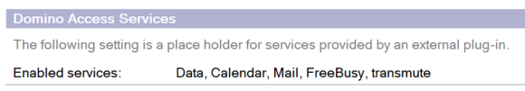

# Enabling file preview using Domino File Viewer

Starting from HCL Verse 3.1 users now have the ability to preview file attachments in emails using the Domino File Viewer option. This functionality is made possible by the Domino Access Service called `transmute`. This is a good option for previewing attachments when Connections is not integrated.

1.  To use the Domino File Viewer, the `transmute` service must be enabled in the **Configuration-&gt;Domino Access Services-&gt;Enabled Services** field of the Internet Site Document for the web site, or if Internet Site Documents are not being used, then in the **Internet Protocols-&gt;Domino Web Engine-&gt;Domino Access Services-&gt;Enabled Services** field of the Server Configuration document for the Domino server.

    The `transmute` service is new in Domino 12.0.2, so this feature is supported only on Domino 12.0.2 or above.

    

    If Connections integration is enabled, this feature is disabled regardless of any of the above settings. Connections integration is enabled by setting `VOP_LLN2_BSSUISERVER_URL` in notes.ini. If this feature doesn't seem to be working, make sure your notes.ini does not specify this setting.

    For more information on disabling Connections File Viewer option in {{ fullVerseProductName }}, see the article [KB0077057](https://support.hcltechsw.com/csm?id=kb_article&sysparm_article=KB0077057).

**Related information**  

[internet protocols - domino® web engine tab \(hcl domino documentation\)](https://help.hcltechsw.com/domino/14.5.0/admin/othr_internetprotocolsdominowebenginetab_r.html)

[Creating an Internet site document \(HCL Domino documentation\)](https://help.hcltechsw.com/domino/14.5.0/admin/inst_creatinganinternetsitedocument_t.html)

