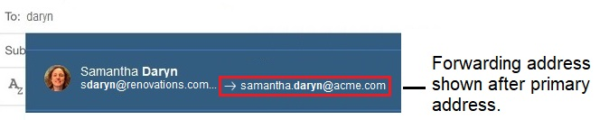

# Enabling integration of forwarding addresses

When a person has a forwarding address – used to deliver mail to an external address – the person's forwarding address and primary directory address can both be shown.

This feature is off by default but an administrator can enable it. Once enabled, in the following scenarios, any forwarding address appears after the primary directory address:

-   Typing a person's name in an address field
-   Selecting a person to add to Important to Me bar.
-   Viewing a person's business card.
-   Searching for a person in the search bar.



1.  To enable this feature, add the following notes.ini setting to the Domino® server that hosts {{ shortVerseProductName }}:

    ```
    VOP_GK_FEATURE_187=1
    ```


