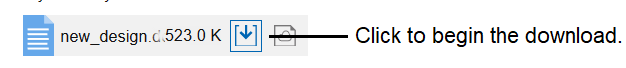
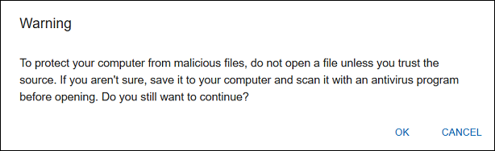
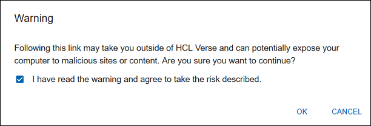

# Enabling the three-click requirement for attachments and links

Use the server notes.ini setting `VOP_GK_FEATURE_217=1` to enhance security by requiring three clicks to download attachments or to access web links.

Enabling this notes.ini setting enhances security by requiring additional steps when users download attachments or access web links.

When enabled, users complete these steps to download attachments:

1.  Start the download:

    

2.  Read and click **OK** at the following prompt:

    

3.  Save the file.

Users complete these three steps to access web links:

1.  Click the web link in a mail message.
2.  In the warning prompt, select the box "I have read the warning and agree to take the risk described."

    

3.  Click OK.

