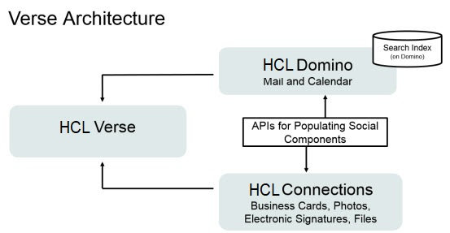

# Overview

{{ fullVerseProductName }} is an email and business messaging experience that is based on an innovative user-centric design, including social analytics and advanced search capabilities. {{ shortVerseProductName }} helps users quickly find and focus on what content is most important, empowering them to build stronger working relationships while optimizing business results.

{{ fullVerseProductName }} brings {{ shortVerseProductName }} to the user desktop in the HCL Domino® environment. To set up {{ shortVerseProductName }}, you complete simple steps on a Domino server to prepare to begin using mail and calendar features. Offline capability is available by default and does not require Domino Offline Services \(DOLS\) configuration.

{{ fullVerseProductName }} brings {{ shortVerseProductName }} to the user desktop in the HCL Domino® environment. To set up {{ shortVerseProductName }}, you complete simple steps on a Domino server to prepare to begin using mail, calendar, and contacts features. Offline capability is available by default and does not require Domino Offline Services \(DOLS\) configuration.


Optionally, you can integrate {{ shortVerseProductName }} with HCL Connections™. This integration leverages information in Connections profiles to enable business cards, photos, and electronic email signatures in {{ shortVerseProductName }}.

If you've purchased Box, you can integrate it with {{ shortVerseProductName }} to enable users to shares files and folders that are stored in Box.

Optionally, you can configure {{ fullVerseProductName }} to work with HCL Docs™ to get an enhanced preview for file attachments. Integration with HCL Docs enables {{ shortVerseProductName }} users to preview PDF, Microsoft Office, OpenOffice and other types of file attachments when reading and composing messages, without having to download those attachments first.

You can also deploy extensions to extend the functionality and experience of {{ shortVerseProductName }}.

