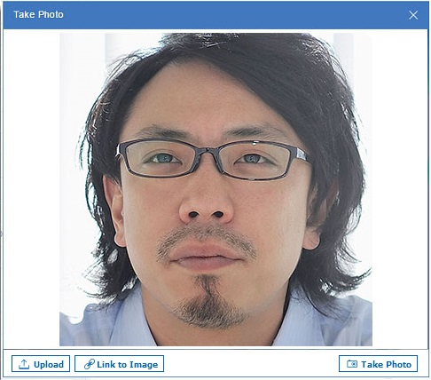


# How do I show my picture?

You can add or change the picture of yourself in the Verse "important to me" bar by uploading an image, pointing to a URL that has an image, or taking a photo of yourself. Or, you can use an image that you've added to the Gravatar web site.

1.  Click the arrow next your name at the top, right of Verse, then select **Change My Picture**. If you don't see this option, your administrator hasn't enabled it.
2.  If you haven't already, when you're prompted to, give Verse permission to use your camera. 
3.  Click any of the following options:
    -   To upload an image from your computer, click **Upload**.
    -   To use an image stored on a web site, click **Link to Image** and specify the web site URL. This option may not be available depending on how your administrator configures this feature.
    -   To take a photo to use as the image, click **Take Photo**

## Gravatar

If your administrator allows you to, you can upload an image of yourself to an account on the Gravatar web site \(gravatar.com\). Then your image is seen automatically in the Verse "important to me" bar.

1.  Go to the [Gravatar web site](http://www.gravatar.com).
2.  Create an account, providing your Verse email address. This step creates a WordPress account for you and WordPress sends an email to you to activate your account.
3.  Open the WordPress email and activate the account.
4.  Add the image to Gravatar.

**Parent topic:** [User Documentation](../user/welcometoibmverse.md)

