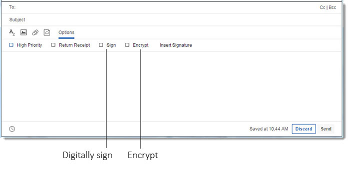
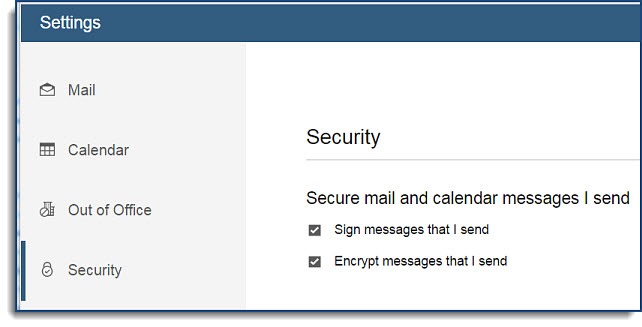

# How do I digitally sign and encrypt my messages?

When sending mail with HCL Verse, you can add a digital signature and encrypt it for additional security.

Select **Options** on the message to open an additional menu. From there, you can either add a digital signature, add encryption to the message, or both.

**Note:** You can set HCL Verse to automatically encrypt and sign your mail messages. Click your current profile picture. From the drop down menu, select **Verse Settings**, then click the **Security** tab.

**Parent topic:** [How do I master mail?](../user/Verse_mail.md)

