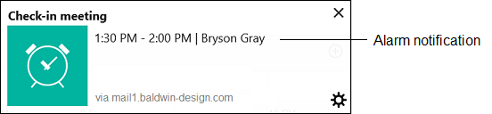
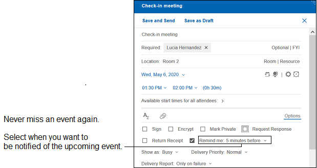
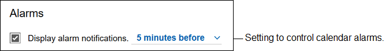

# How do I use calendar alarms?

With calendar alarms, HCL Verse displays a small message on your desktop before your meeting is about to begin. Clicking the notification takes you right to the meeting event in your calendar.

**Note:** Calendar alarms display differently depending on the browser you are using. Check your notification settings in your browser to configure how they display, as well to ensure they are enabled.

There are no additional applications to install. Calendar alarms and alerts are enabled by default. When you create an event in your calendar, you can change the alarm time or disable it completely.

**Note:** Calendar alarms are only enabled for newly created events. Events already on your calendar will not have alarms.

To turn off calendar alarms or change when they are shown by default, click **Verse Settings** from your profile drop down and go to the **Display alarm notifications** setting.

**Note:** This setting only stops alarms from displaying. Alarms will still be set by default when new invitations are created.

**Parent topic:** [ How do I manage my calendar?](../user/faq_calendar.md)

