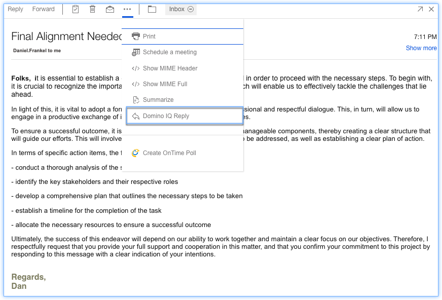
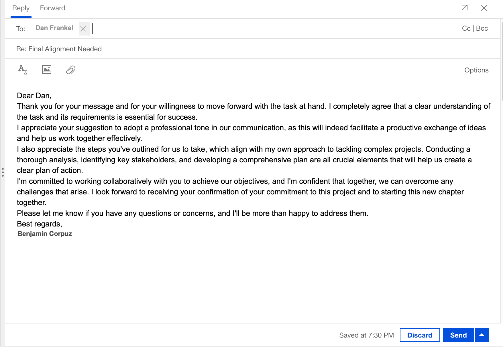

# Have Domino IQ suggest a reply email 

Starting in {{ fullVerseProductName }}, users will have a Domino IQ Reply and Domino IQ Reply to All action available in the action bar of a Mail message. This action generates an automatic reply to the selected mail which may highlight key action items and dates to help the user quickly reply to the email thread. See the admin documents for [Enabling Domino in Domino platform](../admin/enabling_dominoiqreply_summarize.md).

Starting in HCL Verse 3.2.7, users will have a Domino IQ Reply and Domino IQ Reply to All action available in the action bar of a Mail message. This action generates an automatic reply to the selected mail which may highlight key action items and dates to help the user quickly reply to the email thread. See the admin documents for [Enabling Domino in Domino platform](../admin/enabling_dominoiqreply_summarize.md).  


1. Click email.
2. Click the ellipsis () icon.
3. Click Domino IQ Reply or Domino IQ Reply to All action.

Domino IQ automatically creates a draft reply in your mailbox. You can review and modify the generated response as needed before sending it.

**Parent topic:** [How do I master mail?](../user/Verse_mail.md)
