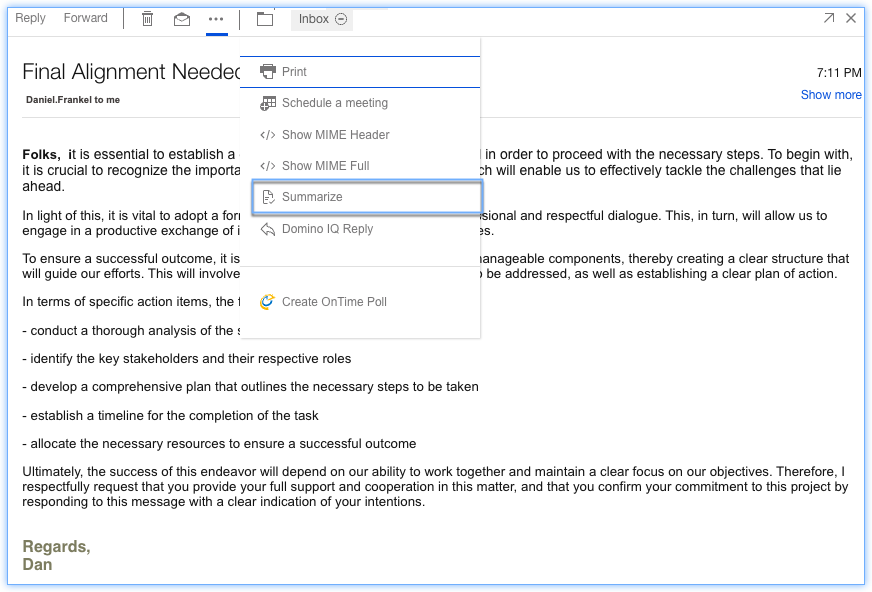
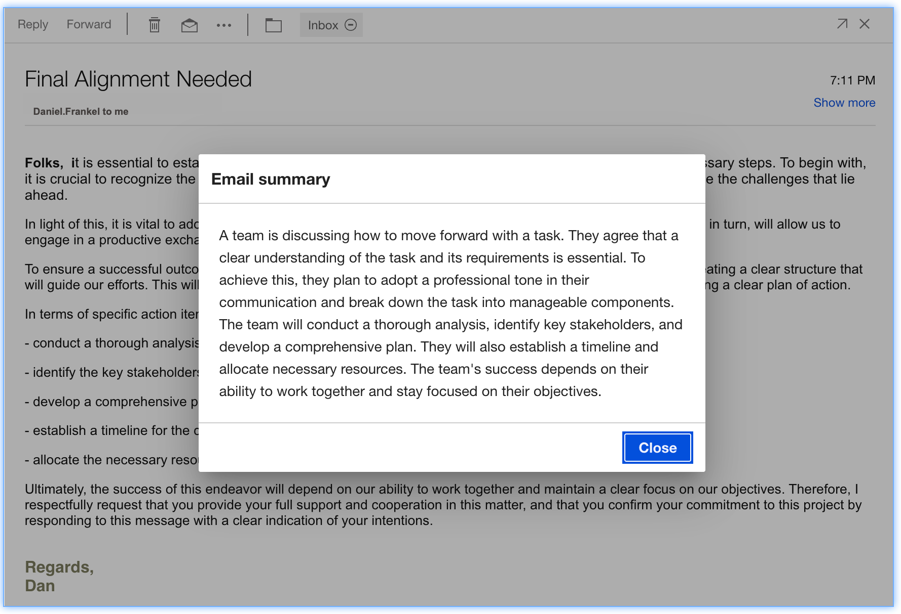

# Summarizing Email with Domino IQ


Starting in {{ fullVerseProductName }} 3.2.7, users will have a **Summarize** action available in the action bar of a Mail message. This action generates a summary of the selected Mail thread which may highlight key action items and dates to help the user quickly understand the context of the email thread. See admin documents for [Enabling Domino IQ in Domino platform](../admin/enabling_dominoiqreply_summarize.md).

In {{ fullVerseProductName }}, users have a **Summarize** action available in the action bar of a Mail message. This action generates a summary of the selected Mail thread which may highlight key action items and dates to help the user quickly understand the context of the email thread.  


1. Click email.
2. Click the ellipsis () icon.
3. Click Summarize action.

**Parent topic:** [How do I master mail?](../user/Verse_mail.md)
