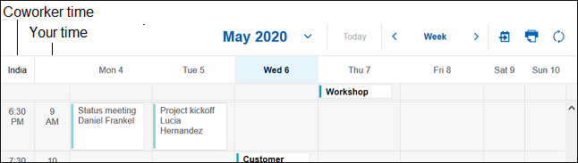

# How do I show an additional time zone?

Do you have co-workers that are in a different time zone? Show the time from their time zone in your calendar to make it easier to schedule meetings with them.

Select **{{ shortVerseProductName }} Settings** and in the Calendar section select **Display an additional time zone**. Select from the list of times zones, give the time zone a label, and save the change.

The additional time zone is shown in the Day or Week view of your calendar:

**Parent topic:** [How do I manage my calendar?](../user/faq_calendar.md)

