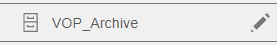
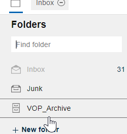
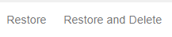

# How can I manage my archived mail?

You can view the messages in an archive mail file on a server, add messages to the archive, and restore messages from it.

## Opening an archive file

To open an archive mail file, from the Folders panel in mail, click the archive folder  at the end of your folder list. For example:

## Archiving a message

To move a message to an archive mail file, open the message and select the archive from the Folders drop-down within the message:

Or, just drag the message to the archive in the Folders panel.

## Restoring an archived message

To restore an archived message to your mail file, select the archived message in the archive mail file. Select the **Restore** action to restore it but also keep it in the archive. Select the **Restore and Delete** action to restore it and delete it from the archive.

## Features that are not available from archived mail

The following features are not available from archived mail:

-   Replying to or forwarding a message from mail **1**
-   Responding to a calendar invitation, for example, accepting, declining, rescheduling.
-   Composing a message
-   Creating a calendar event
-   "Important to me" people in the top bar
-   {{ shortVerseProductName }} Settings
-   Mail notifications
-   Calendar alarms
-   Offline use
-   Viewing mail and calendar for others
-   Importing a calendar

**1** This feature is not available by default, but your administrator can enable it.

**Parent topic:** [How do I master mail?](../user/Verse_mail.md)

**Related information**  

[Enabling replying to and forwarding messages from archived mail](../admin/enabling_mail_and_calendar_actions_for_archived_mail.md#)

