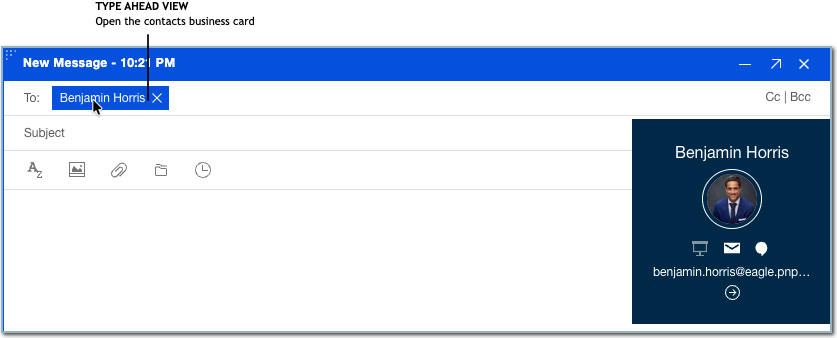
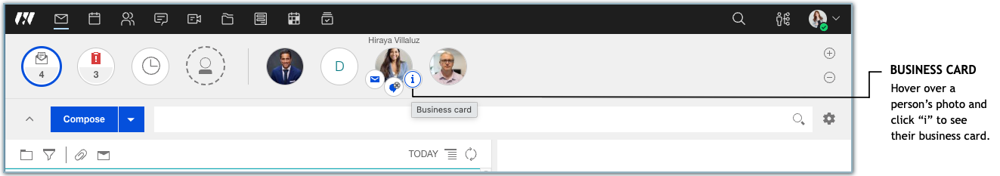
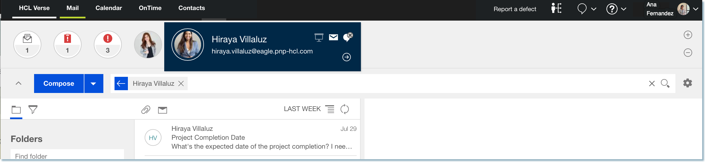

# How do I use business cards to see my colleagues' information with {{ fullVerseProductName }}?

{{ fullVerseProductName }}® business cards keep all the necessary personal information for your contacts within easy reach, while at the same time taking it one step further. In {{ shortVerseProductName }}, the business card is more than just a source of contact information, it becomes a modern social tool, giving you the opportunity to interact with your colleagues in a variety of ways.

You can bring up a contact's business card in several ways. Hovering on a name in the message list until the View Business Card tip appears. Click the name at that point, and the business card displays. You can also open a contact's business card by clicking their name in the message view \(recipients\), or from that person's photo in the Favorites bar. For the photo, hover your mouse over their picture, then click the Information icon to display the card. Finally, when search results display as you enter a recipient's name into a new message, you can click the information icon next to the name of any person in the search result to display their card.

In addition to providing your contact's personal information, you can perform a variety of tasks: 




 




 
-   Select the **Compose** icon to write them a message.
-   Select the **Chat** icon to start chatting with HCL Sametime®.

    **Note:** Sametime Chat can be replaced with another product by your organization. For help with other chat products, see their documentation.

-   Select the **Meeting** icon to begin a meeting with your contact.
-   Select the **More Actions** arrow for additional options, including:
-   Select **View Messages** to show all messages received from the contact.

-   Click **Follow** or **Unfollow** to either follow or stop following the contact's profile within HCL Connections™.
-   Click **View Profile** to see the contact's Connections profile if they have one.
-   Select **View Files** to see the contact's Connections file library if they have any.


To exit the business card, just click anywhere else on the page, or use the Escape key.

**Parent topic:** [User Documentation](../user/welcometoibmverse.md)

