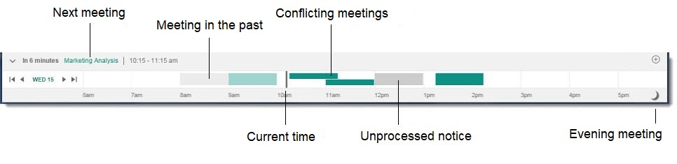
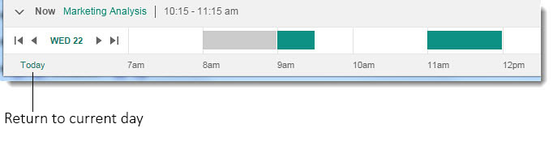

# How do I use the Calendar Bar?

HCL Verse goes beyond the straight forward calendar functionality you're used to by giving you a visual and intuitive calendar experience integrated right in your message Inbox. It's almost like having a personal assistant.

From the Inbox, you'll notice is the Calendar Bar that runs the length of the bottom of the screen and shows your entire day at a glance.

The current time is the vertical bar in the time line. Meetings behind the line are meetings that occurred in the past and are faded in color. Meetings in front of the line are meetings still to come.

Note that the subject of your next meeting appears at the top of the bar. Clicking on the title of the meeting scrolls the Calendar Bar to the meeting in question and a brief summary displays.

You can view meetings with the Calendar Bar in several ways.

-   Click the arrow buttons near the date indicator. Each click scrolls the bar four hours forward or back.

-   Use your mouse wheel with your pointer at the top of the Calendar Bar.

-   Scroll to the previous or following day by using the arrow buttons next to the date indicator.

-   Pick a specific day to view by clicking on the date indicator then choosing the day you want to see.

If you have meetings that take place after 6:00 pm and before Midnight that are not visible in the Calendar Bar, an Evening icon displays on the right edge of the bar. Clicking it quickly shows you your evening meetings.

Remember that at any time if you've scrolled your calendar away from the current day, you can always get back to it by clicking the "Today" button.

**Parent topic:** [How do I manage my calendar?](../user/faq_calendar.md)

