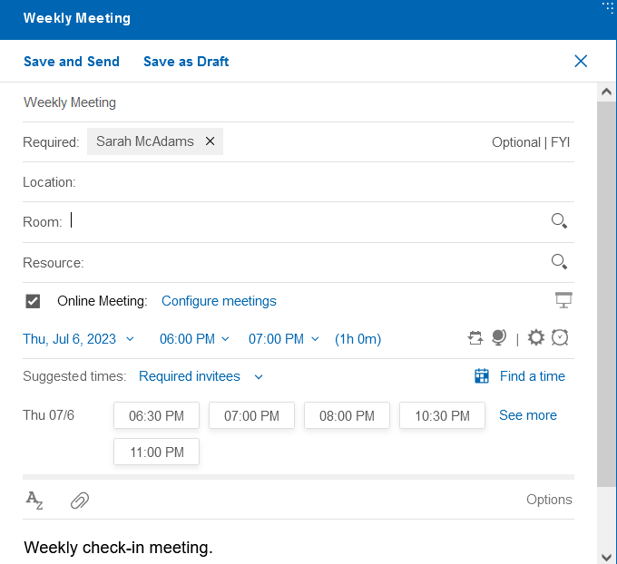
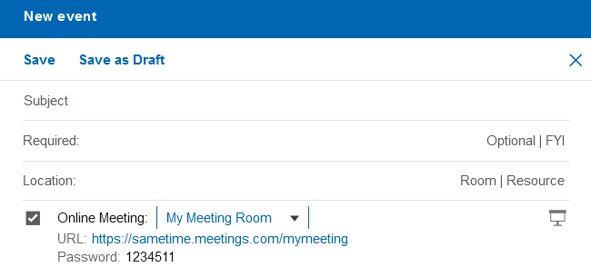
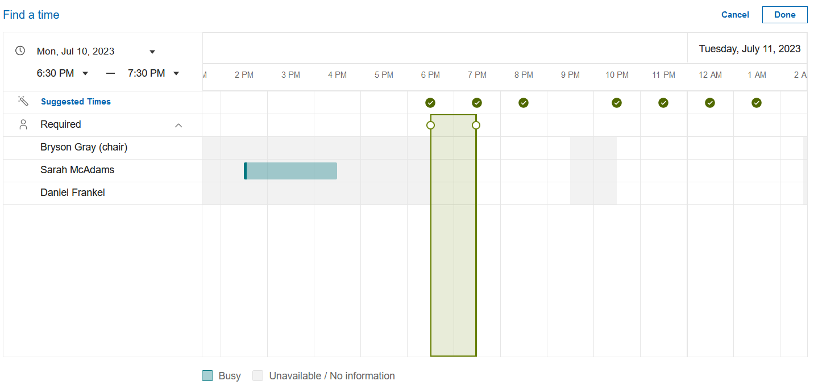
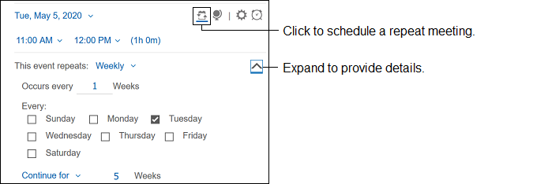
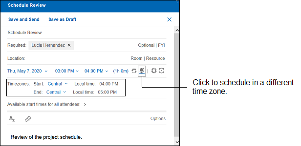
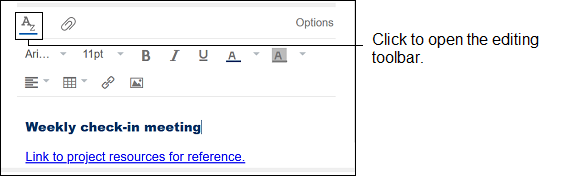
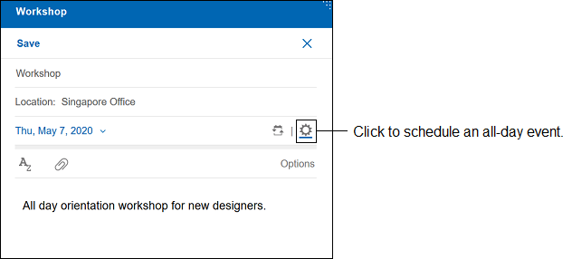
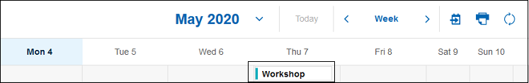
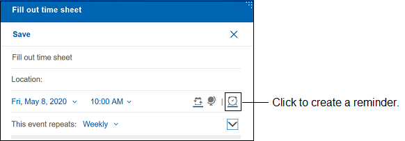
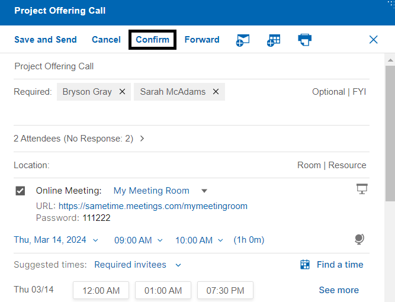

# How do I schedule a meeting?

You can schedule meetings from the Calendar Bar or the Calendar Inbox.

From the Calendar Bar, click the **+** button or an empty time slot in the calendar bar. From the Calendar Inbox, click the **New** button. You'll be presented with a form to schedule a new meeting.

The following picture shows a new meeting with basic options filled out.

The following features are also available.

## Online meeting Configuration

When you schedule a meeting, you can select the online meeting option. The meeting that is chosen as the default meeting in the list can be configured in **Verse Settings**. The list of meetings in the drop down are the meetings that are configured in the Verse Settings page. You can navigate to the **Online Meeting Configuration** section of **Verse Settings** by choosing the **Configure Meetings** option in the meeting drop down list.

## Find availability of invitees

When scheduling a new meeting, you can find the availability for required invitees \(default\) or for all invitees. Click on **Find a time** and choose the desired time slot. You can select from the suggested time or drag the slider to select the desired time.

## Schedule a repeat meeting

Schedule a meeting to repeat at a specified interval and duration.

**Note:** If the selected interval and duration result in 1000 or less instances of the meeting, you can **Save** or **Save and Send** the recurring event. However, if the number of instances exceeds 1000, you will receive an alert message informing you that you have exceeded the limit, and the **Save** and **Save and Send** function buttons will be disabled.

## Schedule the meeting for a different time zone

You can schedule a meeting in a different time than your time zone. The meeting shows in the calendar in that time zone.

## Customize the meeting description

Open the editing toolbar to customize the meeting description. Change the font or text alignment. Add a table, link, or image.

## Schedule an all-day event

Schedule an all-day event. Use the repeat meeting option to extend it for more than one day.

The event shows at the top of your calendar:

## Create a personal reminder

Create a reminder. For example, remind yourself to fill out your time sheet each week. You need to select just a start date and time.

## Use Options

Click **Options** and select any of these options:

<table markdown id="table_rhg_kbt_4lb"><thead><tr><th>

Option

</th><th>

Description

</th></tr></thead><tbody><tr><td>

**Sign**

</td><td>

Digitally sign the meeting invitation.

</td></tr><tr><td>

**Encrypt**

</td><td>

Encrypt the meeting invitation.

</td></tr><tr><td>

**Mark Private**

</td><td>

Prevent someone who manages your calendar from reading the content of the meeting.

</td></tr><tr><td>

**Request Response**

</td><td>

Receive a notice from each optional and required attendee, room, and resource that responds.

</td></tr><tr><td>

**Return Receipt**

</td><td>

Receive a message from each attendee who opens the invitation.

</td></tr><tr><td>

**Remind me**

</td><td>

Choose when to receive a reminder about the meeting.

</td></tr><tr><td>

**Show as**

</td><td>

Select **Busy** to indicate to others that you are busy at the selected time. Select **Available** to show that you are available.

</td></tr><tr><td>

**Delivery Priority**

</td><td>

Select one of the following options: -   **High** Route the invitation immediately and display a High priority icon next to the invitation in each recipient's Inbox.
-   **Normal** Route the invitation the next time your mail server sends mail \(default\).
-   **Low** Wait until off-peak hours to route the invitation \(usually between midnight and 6:00 AM\).

</td></tr><tr><td>

**Delivery Report**

</td><td>

Select one of the following options: -   **None** Don't send delivery reports.
-   **Only on failure** Send a report when invitations can't be delivered.
-   **Confirm delivery** Send reports when invitations are delivered.
-   **Trace entire path** Send a report from each server through which an invitation is routed and a final report indicating whether the invitation was delivered.

</td></tr></tbody>
</table>## Confirm meeting as a chair

The HCL Verse 3.2.1 release allows the chair of a meeting to confirm the meeting. Confirming a meeting will send all invitees a Confirmation notice. To confirm a meeting, go to **Calendar**. Open the meeting and click on **Confirm**. Optionally, type comments to add to the Confirmation notice and click OK.

**Parent topic:** [How do I manage my calendar?](../user/faq_calendar.md)

