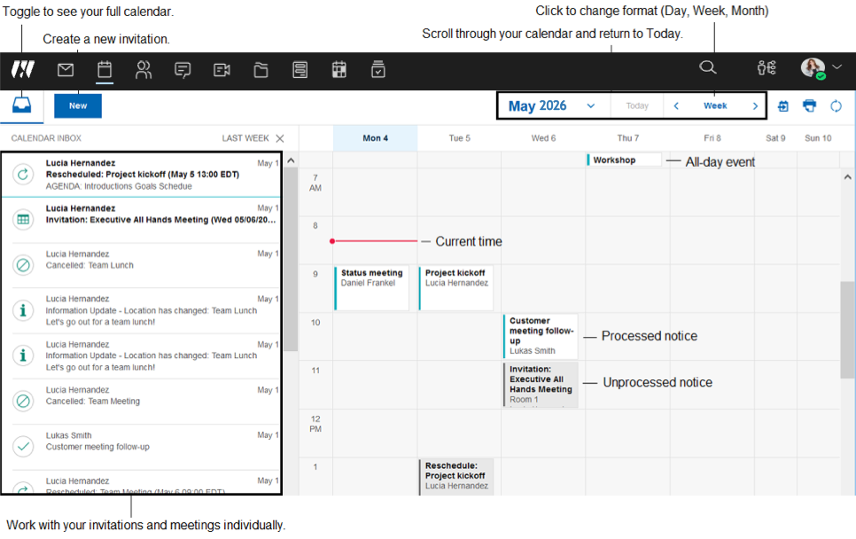
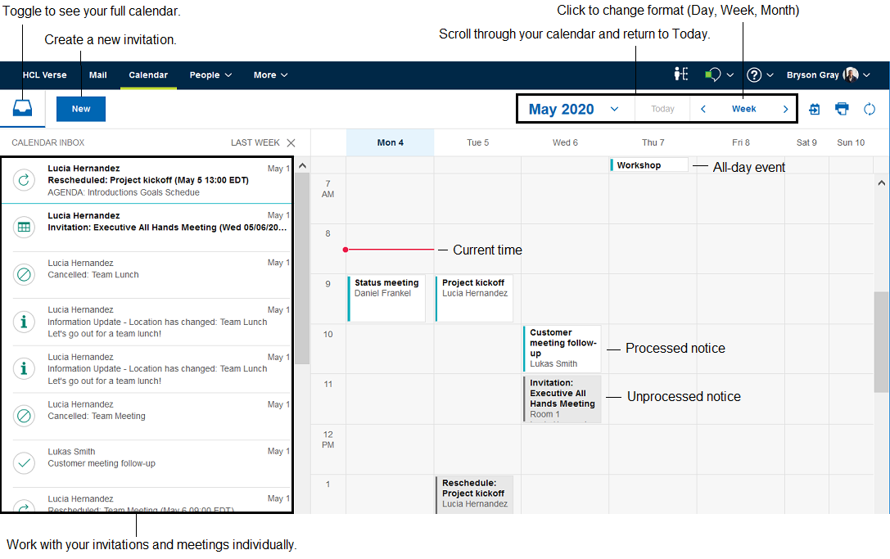

# How do I use the Calendar Inbox?

Make better decisions when responding to calendar notices by viewing your calendar at the same time. The Calendar Inbox organizes all your calendar notices in one place.

Click the **Calendar** button in the navigation bar, and you'll see the Calendar Inbox. Here, you can see at a glance what your day looks like before responding to invitations. New calendar invitations and notices automatically go to the Calendar Inbox, though you can still respond from your Mail Inbox as well.

What can you do here?

-   Schedule a meeting and block personal time with one click on any Calendar time slot so you're never overbooked.
-   Forward Calendar notices to others.
-   Drag and drop existing events on the Calendar to reschedule if you're the owner, or to propose a new time if you're not.
-   Copy and paste meeting info to easily create a new invitation with existing content.




 
**Parent topic:** [How do I manage my calendar?](../user/faq_calendar.md)

