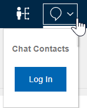
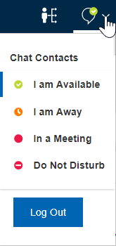
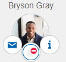

# How do I chat with people important to me?

HCL Verse® gives you intuitive, integrated access to HCL Sametime® Chat in a way you've never had before. You can message colleagues all with the click of a button from the Verse interface.

**Note:** Sametime Chat can be replaced with another product by your organization. For help with other chat products, see their documentation.

First, log in to your HCL Sametime server using the drop-down arrow at the top of the screen:

Once logged in you can start a web chat, change your status, and view your contacts list from the drop-down.

You can chat with colleagues in other ways, too. The easiest option is to select the Chat icon from the mouse over menu on any of the [people](faq_people.md#) listed at the top of your screen.

You can also start a chat with someone from your contacts list, from a contact's [business card](faq_biz_cards.md#), or from a message you receive from them.

## **Using the Sametime Connect Client**

By following a few easy steps, you can use the Sametime Connect Client to chat with colleagues from Verse instead of the embedded web chat client. The Sametime Connect Client has mas many more features. You must use Sametime Connect Client V9.0.1 or later.

The order in which clients are started is important. Start by logging in with the Sametime Connect Client. Your administrator can tell you which community to log into. Next, log into Verse, followed by the web chat client. When you start a chat with people in the Important to Me bar, or click on a business card, you'll then open the Sametime Connect Client window.

## Using chat option in offline and do not disturb mode

You can leave a message for colleagues if they are offline or mark themselves as "Do Not Disturb".

 

This feature requires Sametime version 11.6.2 or higher FP or Sametime version 12 or higher and the persistent chat option enabled on the Sametime server.

**Parent topic:** [User Documentation](../user/welcometoibmverse.md)

