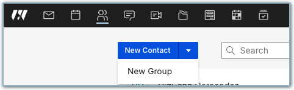
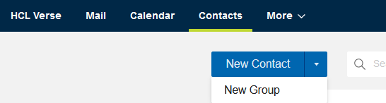
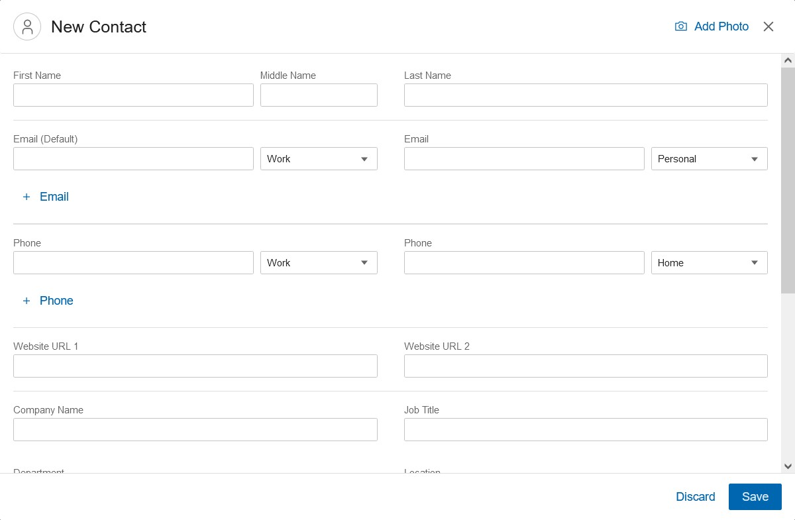
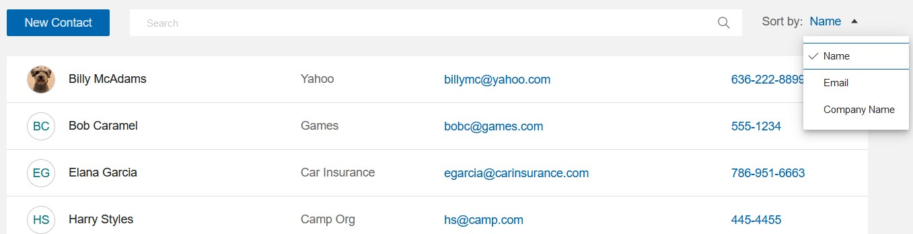
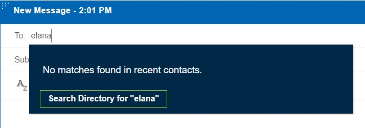
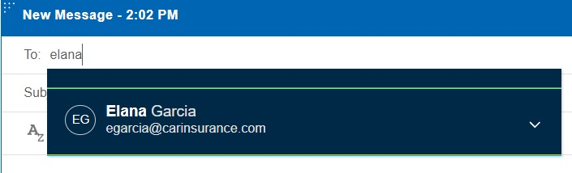
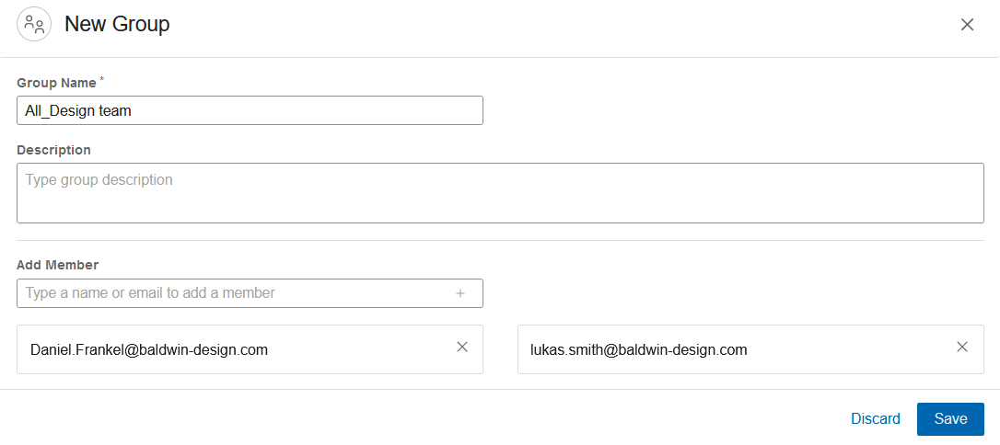
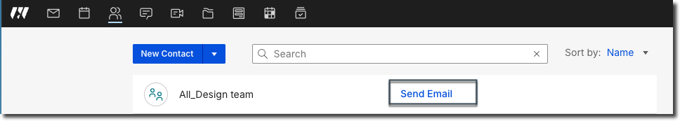
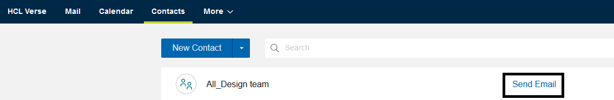

# How do I manage my personal contacts?

Add contacts to save information about the people you communicate with in {{ fullVerseProductName }}.

## Adding New Contact

To add a contact, click **Contacts** &gt; **New Contact**:




 
Add a name and any other information that you want and then save the contact. You can add photo, phone numbers, email addresses, web site addresses, work information, birthday and anniversary dates, and postal addresses.

Your list of contacts looks like this. If your contact list is long, use search to find a contact. Click a contact to open it and see details about the contact. While it's open, you can edit or delete it.

The live email and phone number features allow you to send direct email or meeting invite or make a direct call to your contacts. When you click on the email address of any contact, the compose window opens directly. When you click on the phone number of any contact, it will direct you to your chosen application of teleprotocol to make a call. You can also sort the contact list according to the Name, Email, and Company name of your contacts.

To send an email or meeting invitation to your contacts, type the contact name or address in the addressing field. Similar to the way you search for names in a directory, use the "Search Directory for" feature to find the new contact, then select their name. Thereafter, the contact automatically appears in the addressing field when typing the name or address.

## Adding New Group

To add a group, click **Contacts** &gt; **New Group** from the split button:




 
The group name and at least one group member is required. After adding members to the group, click **Save**.

 
You can send an email to the group.




 

**Parent topic:** [User Documentation](../user/welcometoibmverse.md)

