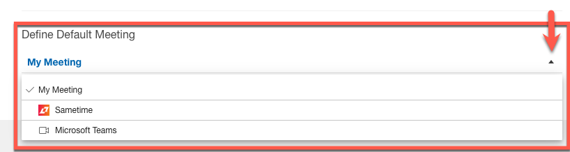
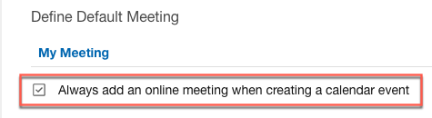

# How can I set my default meetings?

This enables users to set their preferences for adding online meetings to new events automatically.

**Procedure:**

1.  Go to the **{{ shortVerseProductName }} Settings** &gt; **Calendar** &gt; **Define Default Meeting**.
2.  Select a meeting from the **Define Default Meeting** dropdown list.

    

3.  Select the checkbox to always add an online meeting when creating an event.  

    

For more information, see [Controlling if the default online meeting is used automatically](../admin/options_online_meeting.md).

**Parent topic:** [How do I personalize {{ shortVerseProductName }}?](../user/faq_settings.md)

