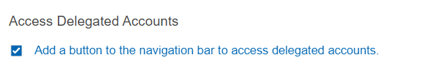
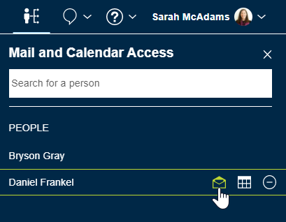
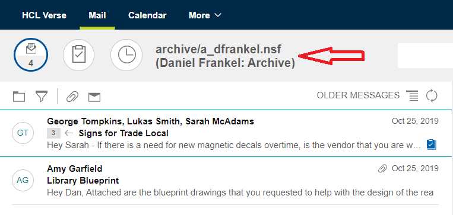

# How do I access mail and calendars delegated to me?

Set up Verse to view or manage other people's mail and calendars. The first step is to add a button to the navigation bar so you can open the delegation panel where you can add and access delegated accounts.

**Note:** Starting with HCL Verse 3.2.6, if the administrator has configured an option for delegation redirect, and if you are given Calendar-only delegation access and try to open the Mail page, Verse will redirect you to the Calendar page.

1.  Open **Verse Settings** &gt; **Delegation**.
2.  Select **Add a button to the navigation bar to access delegated accounts** and then click **Done**.

    

3.  Click the  icon in the navigation bar to open the delegation panel for Mail and Calendar Access list.
4.  Select the name of the account to open and click the mail or calendar icon to open it.

    

Managed mail and calendars open in separate browser tabs. Watch for red badges on the tabs to alert you when there are new messages or calendar notices.

## Accessing delegator's Archive mail file

Beginning with HCL Verse 3.2.2, if you open a mail file that has been delegated to you, you will see any configured archives that the delegator has when you open the Folder Panel. You can open the archives by clicking on them.

When you open any listed delegator's Archive folder, user and archive details appear near the top of the page.

**Parent topic:** [How do I use mail and calendar delegation?](../user/faq_how_use_mail_delegation.md)

