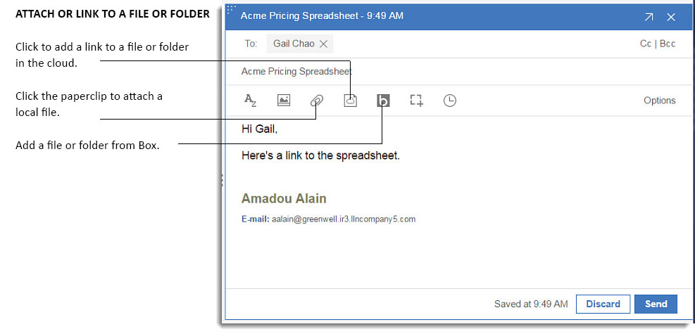
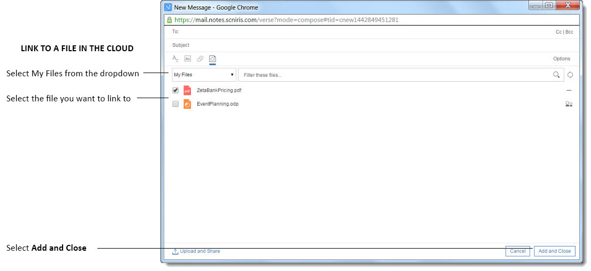
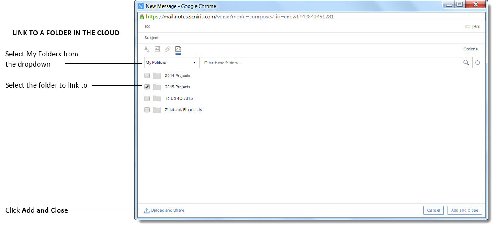
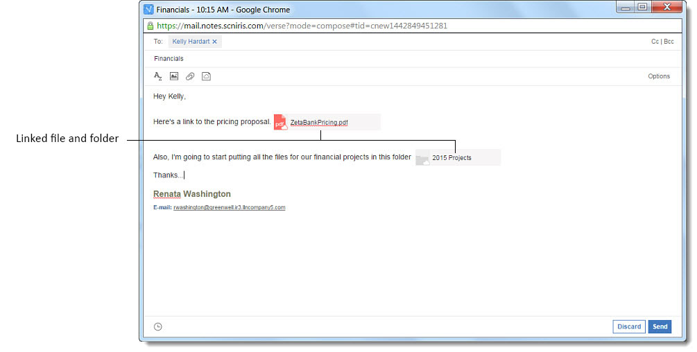
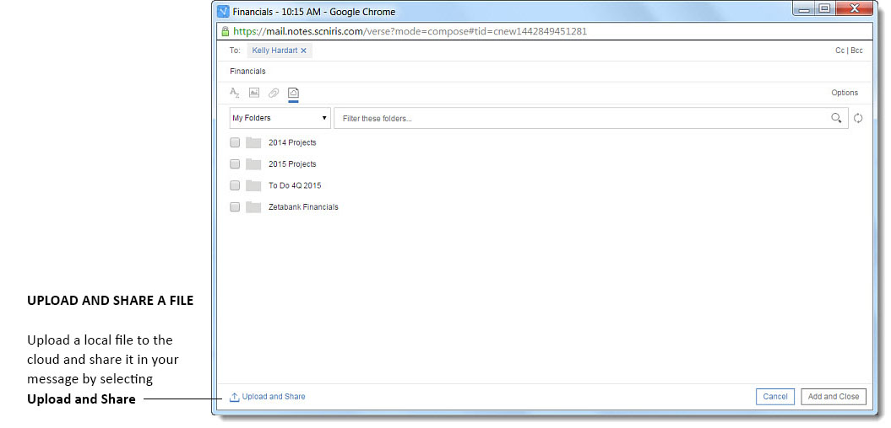

# How do I share and link to my files?

Going beyond simple file attachments, you can share files and link to folders in the cloud. When composing a message, you can select files from your computer or files and folders from Domino Workspace Files.

{{ fullVerseProductName }}® goes beyond simple file attachments by allowing you to share files and link to folders in the cloud. When composing a message, you can select files from your computer or files and folders from HCL Connections™.

You can attach a local file from your computer to a mail message, or link to a Connections File. Connections Files can be added to the message as links so that recipients always have access to the latest version. If you have a file on your computer and have not had time to upload it to Connections, you can do so and link to it in one step while composing your message. You can also include a link to Connections Files folders.

People in your organization who have Connections accounts are automatically given access to the files and folders you share with them.

In addition, {{ shortVerseProductName }} gives you the option to upload a local file on your computer to Connections Files and share it as a link in your message in one step.

When reading a message, you can also view attachments and Connections Files directly in {{ shortVerseProductName }} with one click, as well as download, upload attachments to My Files, or view Connections file details. If you click an attachment that is an Open Office document, or a Microsoft™ Office presentation, spreadsheet, or document, you can view the file before you download it, as well.

## Box  integration with {{ fullVerseProductName }}

If your system administrator has enabled it, you can share files from Box seamlessly with {{ shortVerseProductName }} when composing or viewing mail. When composing, select the Box icon  to choose a file from your Box repository to attach. You can also attach folders as well as files, using Box.

When viewing mail, click any of the file attachments or location links with a Box icon  to download, preview, or open their location in Box.

 
 **Parent topic:** [User Documentation](../user/welcometoibmverse.md)

