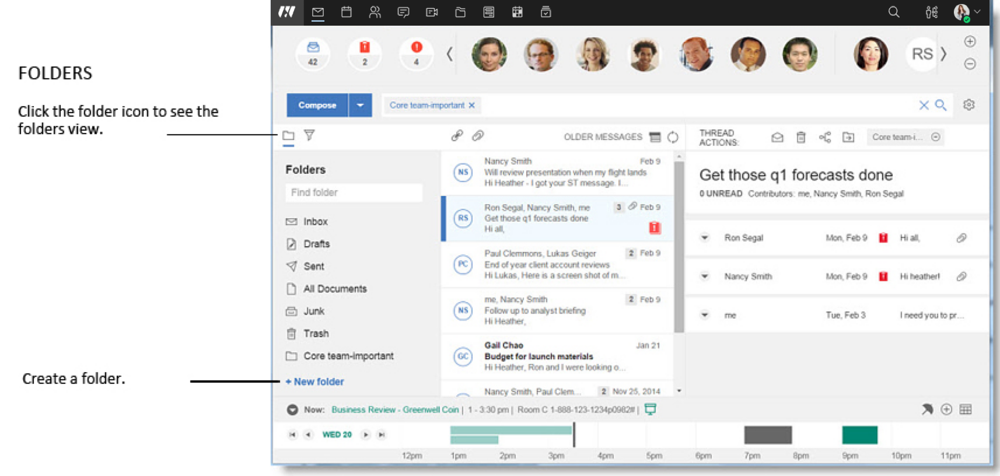
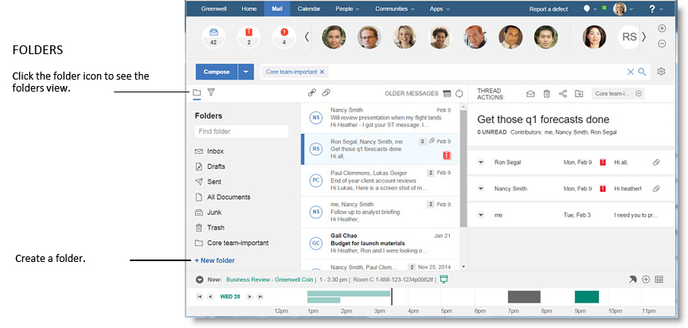

# How can folders keep me organized?

Folders provide a lightweight way for you to organize messages. Folder operations in {{ fullVerseProductName }}®, such as moving messages to a folder, carry over to HCL Notes®, and folder operations in those clients carry over to {{ shortVerseProductName }}.

When you first log into {{ shortVerseProductName }}, the Folders display is collapsed by default. To see your full folder tree, click on the "Toggle folders" button .

From here, you can work with your folders and their messages. In addition, clicking a folder will add it as a filter to the Search bar, and the message list will show all mail within that folder.

You can also search for a specific folder using the Find folder input box.

If you want to create a new top level folder, simply click the "New folder" link .




 
When you hover your pointer on a folder you've created, an "Edit" button displays . Click it to bring up additional folder options, including:

-   "Rename" - Change the name of the folder.
-   "Add subfolder" - Create a subfolder underneath the selected current folder.

There are two ways you can move or add messages to a folder:

-   Drag the message\(s\) to a folder using your mouse.
-   In the message view or list, click the "Move to folder" button.

    Clicking the "Move to folder" button will show the "Move to folder panel". You can either enter the name of the folder in the "Find folder" bar, or select the desired folder from the list.

There are also two ways to remove messages from a folder:

With the current search limited to a specific folder, you can bring up a "Remove from folder" button by hovering the mouse over a message. Clicking the button will remove the message from the folder.

In addition, within the message view, chiclets show which folder\(s\) the current message is in. Click the "Remove from folder" icon in the chiclet to remove the message from the selected folder.

## Select from suggested folders

As you add or move a message to a folder, {{ shortVerseProductName }} suggests ones to select based on the folders you've used previously:

**Parent topic:** [How do I personalize {{ shortVerseProductName }}?](../user/faq_settings.md)

