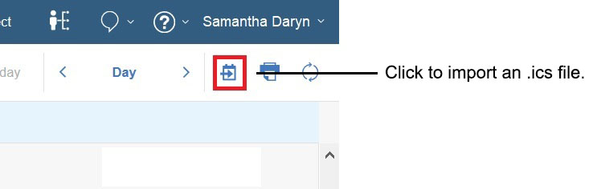
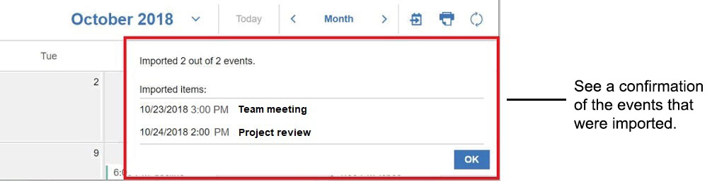

# How do I import events from an internet calendar?

You can import single and repeat events from an internet calendar \(.ics\) file into your HCL Verse calendar. For example, import events from a Google calendar .ics file.

The .ics file that you import can be on your local computer or attached to a mail message.

-   Only events and alarms are imported from the .ics file. To Do, Journal, and busytime entries are not imported.
-   The .ics file must be 5 MB or less.
-   You can import up to 100 events from one .ics file. All occurrences of a repeating event are considered one event.
-   To import the contents of an .ics file that is attached to a message, the message cannot be encrypted.

To import an .ics file saved on your computer:

1.  From your Verse calendar, click the import calendar button at the top, right:

    

2.  Select and open the .ics file.

To import an .ics file attached to a message:

1.  Open the message with the attachment and click the import calendar icon next to the attached .ics file:

    

A prompt confirms the events that are imported. Click **OK**.

**Parent topic:** [How do I manage my calendar?](../user/faq_calendar.md)

