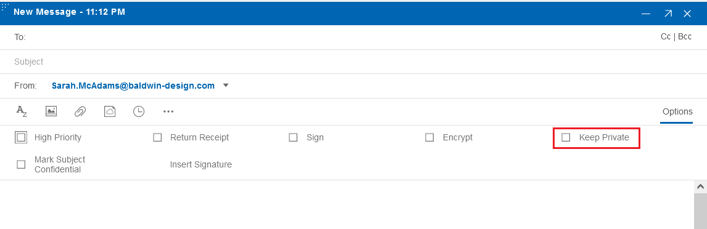

# How can I keep my mails private?

When sending a mail with {{ fullVerseProductName }}, you can choose to keep the mail private.

Select **Options** in the **Compose** window to see additional options. From there, you can check the **Keep Private** option.



When the recipient reads a message that is marked as Keep Private, the following actions are disabled:

-   Reply
-   Reply to All
-   Forward
-   Schedule meeting
-   Print

The following message displays:

```
You cannot forward or otherwise copy the contents of this document. This document is set to prohibit copying and duplicating. 
```

**Parent topic:** [How do I master mail?](../user/Verse_mail.md)

