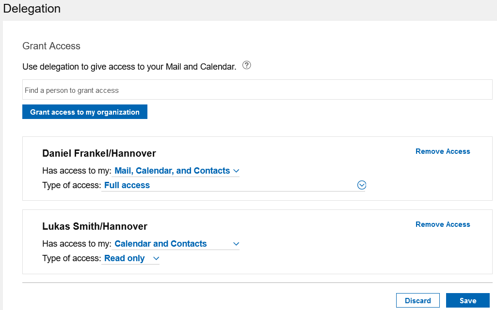
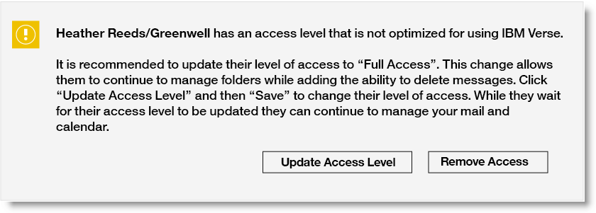

# How do I delegate access to my mail, calendar, and contacts?

Delegate access to your mail, calendar, and contacts, or calendar and contacts only, and specify the level of access.

1. Click your profile image in the navigator bar and click **{{ shortVerseProductName }} Settings** &gt; **Delegation**.

2. Search for the person to whom you want to grant access. Specify whether they have access to Mail, Calendar, and Contacts or only your Calendar and Contacts and the type of access. Wondering how {{ shortVerseProductName }} access levels map to HCL Notes access levels? See [What delegation access levels are available?](faq_delegation_access_levels_on_prem.md).

**Note:** When you delegate to others, you also give access to your To Do items.

**Note:** Each time delegation settings are saved, a request is sent to process the changes and it may take some time for the updates to be applied. While this is going on, a **Pending Changes** banner displays next to the delegate list. Once this goes away, the list should be up-to-date. If any changes are made to the delegation settings while the **Pending Changes** banner displays, they will overwrite any previous changes made.

## What does it mean to give access to an organization?

This option allows anyone within your organization to have the selected access rights to your Mail and Calendar. If you want to grant individuals a different access right, create a separate delegation setting entry for each person. **Organization** access maps to the **Public** access that's available in HCL Notes.


## Warning when access levels are not optimized for {{ fullVerseProductName }}

If you previously delegated your mail and calendar using Notes, and you see the following warning, do not be alarmed. Your delegates still have the access you set up in Notes. In {{ shortVerseProductName }}, their Calendar access is not affected and {{ shortVerseProductName }} is not affected unless they have access to manage your folders. Moving forward it is recommended that you update the level of access that is recommended in the {{ shortVerseProductName }} UI, but this should not block your delegates from the key functionality of managing your mail or calendar.



**Parent topic:** [How do I use mail and calendar delegation?](../user/faq_how_use_mail_delegation.md)

