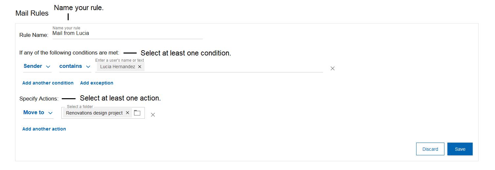
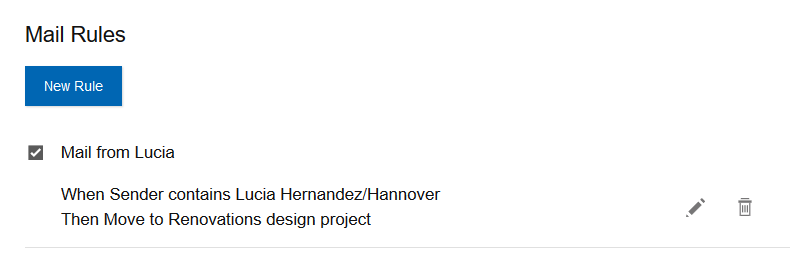
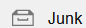
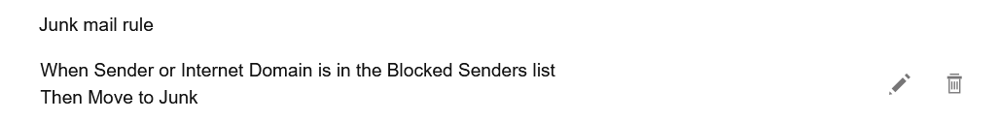

# How can mail rules help me organize my incoming mail?

Mail rules help you direct the flow of your incoming mail by choosing actions to take based on conditions that you specify. You can see all the mail rules in the Verse setting.

Here are a few examples of how mail rules can help you but there are many variations possible:

-   Copy all mail received from a particular sender to a folder.
-   Copy mail flagged as High priority to a folder called Urgent.
-   Delete all messages received from a particular internet domain.
-   Use a Junk Mail rule to move all future mail received from a particular sender to the Junk folder. See **How do I use the Junk Mail rule?** at the end of this topic.

Mail rules that you create in HCL Notes® carry over to HCL Verse and vice versa. To create a mail rule:

1.  Select **Verse Settings** &gt; **Mail** and then scroll to the **Mail Rules** section.
2.  Click **New Rule**
3.  Enter a name for the rule.
4.  Select at least one condition for the rule and any exceptions.
5.  Select at least one action to take on messages that meet the condition.
6.  Click **Save.**

Use the edit or trash icons to edit or delete rules. To disable a rule, uncheck it.

## How do I use the Junk Mail rule?

When you receive mail from a particular sender, you can move it to the Junk folder. When you do, you have the option to move all future mail from the sender to the Junk folder by adding the sender to your Junk Mail rule in Mail settings.

To add a sender to the Junk Mail rule:

1.  Open a message from the sender.
2.  Select the folder  in the toolbar and then select the Junk folder .
3.  You see the message **Your message was moved to Junk**. To send future messages to Junk, click **Add users to the Junk Mail rule**.

    

4.  You see the message **The sender\(s\) have been added to the Junk Mail rule.** If you want to open the Junk Mail rule in Mail settings, click**View Junk Mail Rule**

    

    The Junk Mail rule setting looks like this:

    

5.  If you edit the Junk mail rule, you see the sender listed. You can remove the sender from the Junk mail rule at any time.

**Parent topic:** [How do I master mail?](../user/Verse_mail.md)

