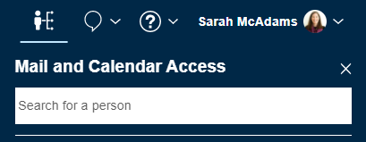
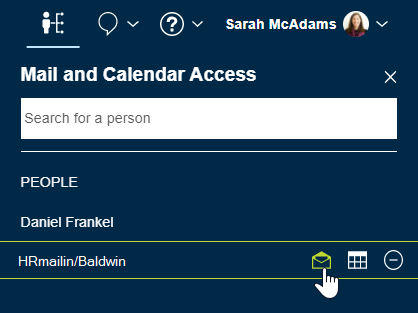

# How do I open a mail-in database?

Open a mail-in database from the delegation panel.

A mail-in database is a mail and calendar file that is created on the server for multiple users to share. When you're given access to a mail-in database, you can open it through the delegation panel.

To open a mail-in database that you've been given access to:

1.  Click the  icon in the navigation bar to open the delegation panel for Mail and Calendar Access list.
2.  Search for and select the name of the mail-in database to add it to the list.

    

3.  To open the mail-in database, click the mail icon next to the mail in database name in the list:

    

**Parent topic:** [How do I personalize Verse?](../user/faq_settings.md)

**Related information**  

[Setting up mail-in databases](../admin/setting_up_mailin_databases.md)

