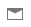
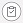
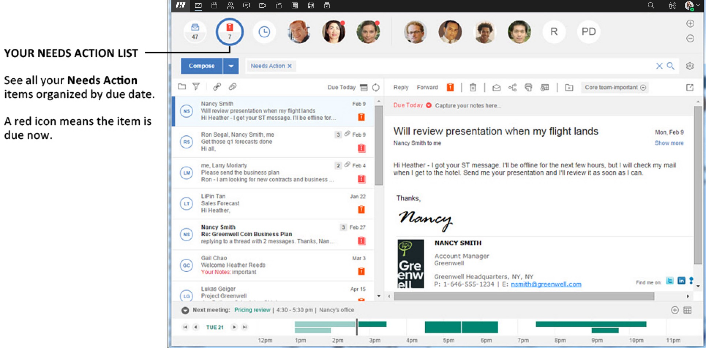
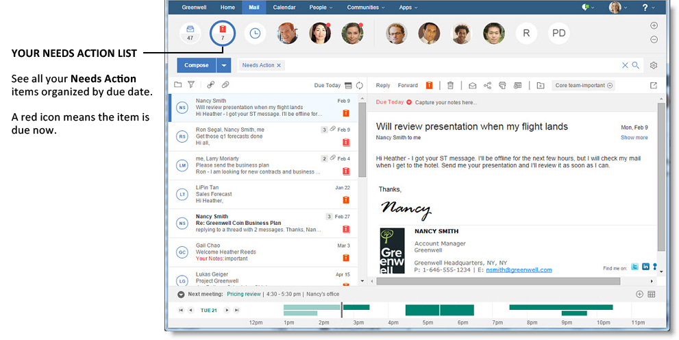

# How do I mark mail that I need to follow up on?

When you receive a mail message that contains an action item, you can add it to a list of things that need to be completed, called **Needs Action**. You can also specify a date for when the action item needs to be completed, to further organize your work flow.

**Note:** If you prefer to track messages that need a response in the message list by marking them as Unread, you can do so by clicking the  icon.

You can add a mail message and its associated action items to the **Needs Action** queue by selecting the Needs Action icon  in either the message list or the message itself. You also have the option to add some additional notes about the item and select a date by which to complete it; Today, Tomorrow, Anytime, or choose your own date.

The mail message is now in the **Needs Action** queue, which you can view by selecting the Needs Action list  from the top menu bar.




 

The messages you've marked as **Needs Action** will display in the message list, organized by the due date you chose. If you did not choose a due date, then they will display at the bottom of the list in a **No Due Date** section.

When you complete a **Needs Action** task, simply click the **Needs Action** icon again to remove it from the queue. You can change or remove a due date from a message in the same way.

**Parent topic:** [How do I master mail?](../user/Verse_mail.md)

