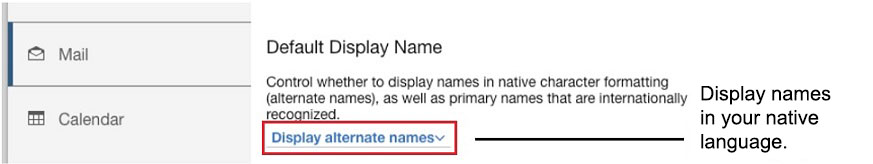

# How do I see names in their native languages?

In work environments that use internationally-recognized names, your administrator may allow you to see names in their native languages and character sets. These are known as alternate names.

Alternate names are displayed in various places in {{ shortVerseProductName }}, for example, in messages, calendar events, when searching the directory, and when hovering over a person's picture.

Your administrator may allow you to choose whether to display alternate names based on the languages configured in your browser. To display alternative names if your administrator gives you the choice, select **{{ shortVerseProductName }} Settings** &gt; **Mail**. For **Default Display Name** select **Display alternate names**. 

If a user has an alternate name in a particular language and you've set up your browser to support the language, you see the alternate name.

If you don't see this option, your administrator hasn't enabled it.

**Note:** Rather than this option, your administrator may set up the server to display alternate names for a specific set of languages automatically. In this case, the alternate names are shown regardless of the language configuration in your browser.

For information for administrators, see [Configuring alternate name support in iNotes](https://help.hcltechsw.com/domino/14.5.0/admin/conf_configuringalternatenamesupportinlotusinotes_t.html) in the HCL Domino® documentation.

**Parent topic:** [How do I personalize {{ shortVerseProductName }}?](../user/faq_settings.md)

