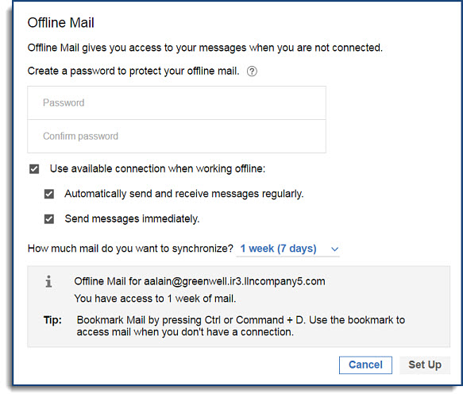

# How do I use {{ shortVerseProductName }} without an Internet connection?

With {{ fullVerseProductName }}, you can still get your work done even when disconnected from the Internet. You can set up {{ fullVerseProductName }} mail to read and write messages offline, and it will automatically send your mail when you connect to the Internet again.

To start, set up offline mail by selecting **{{ shortVerseProductName }} Settings** from the **My Profile** drop down under your profile picture. Scroll down to the **Offline Mail** section, and click **Set Up Offline Mail**.

>Note:
>Starting Verse 3.2.6 IF1, users who had previously set up offline mail will now be prompted to update their offline password upon logging into the new release. 

If a user attempts to work offline without updating the password, they will be prompted again and blocked from offline access until the password is changed.
Configure your offline settings using the menu that displays. You can synchronize up to 30 days of mail.

Once your offline mail is configured, it may take a few minutes before the setup is active and you can begin using Offline mode. When it is, you can switch to Offline mode anytime by selecting **Work Offline** from the **My Profile** drop down menu. When you are online, your offline mail is synced every 15 minutes, if you have an internet connection. You can also select **Refresh Offline** from the **My Profile** dropdown to sync manually. When you're ready to go back online, select **Work Online** under **My Profile**.

**Note:** You can also work in Offline mode with {{ fullVerseProductName }} without an internet connection by launching your browser and entering the {{ fullVerseProductName }} URL. It is a good idea to bookmark this URL, so you don't have to remember it when you do not have an internet connection.

## Offline features

Not all features are available in {{ shortVerseProductName }} offline. Here are some examples:

| {{ shortVerseProductName }} feature | Offline support |
|:---|:---|
| **Attachments** | • Downloading and viewing attachments is not supported. |
| **Threaded messages** | • You can view messages in a thread as individual messages (threads may be partial if not within seven days of downloaded data). • You cannot switch between threaded and non-threaded mail while offline. • Information on the number of messages in a thread is not available. |
| **Folders** | • Inbox, Sent, Draft, All Documents, Trash, and custom folders are all available. • You can move a message to a folder. • You cannot create new folders while offline. |
| **Calendar bar** | • You cannot open or create a full calendar entry from the calendar bar. • New invitations cannot be created. • Calendar invitations are shown but cannot be accepted or declined. |
| **Needs Action and Waiting For** | • You can search and review existing Needs Action or Waiting For items within the seven-day sync period. • You can mark items complete or add new items to either category. |
| **Important People** | • The most recent messages for your Important People can be viewed. • Suggested people are only available online. • The ability to add or remove important people is not available while offline. |
| **Search** | • Search is available while offline, and you can filter results by date, folder, or people. |

**Parent topic:** [How do I personalize {{ shortVerseProductName }}?](../user/faq_settings.md)

