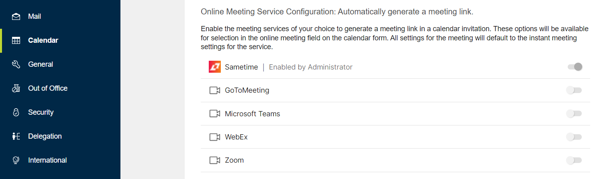
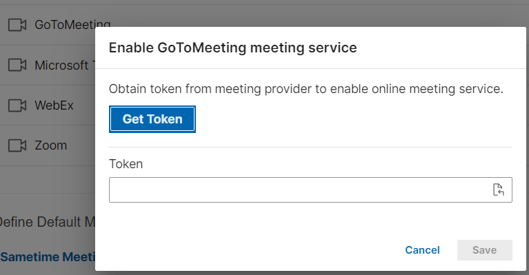
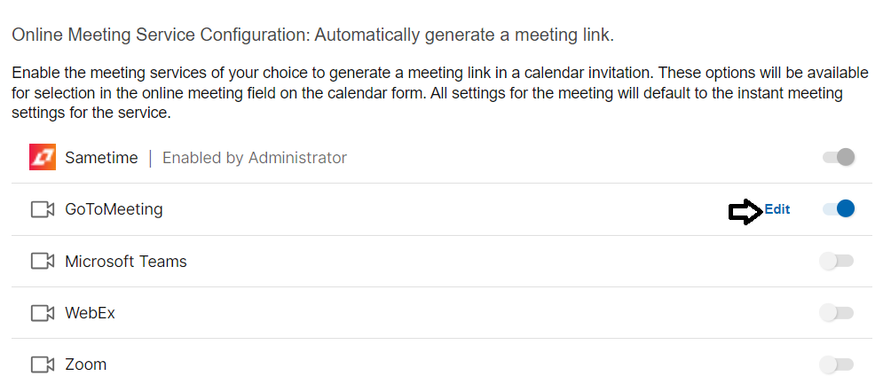
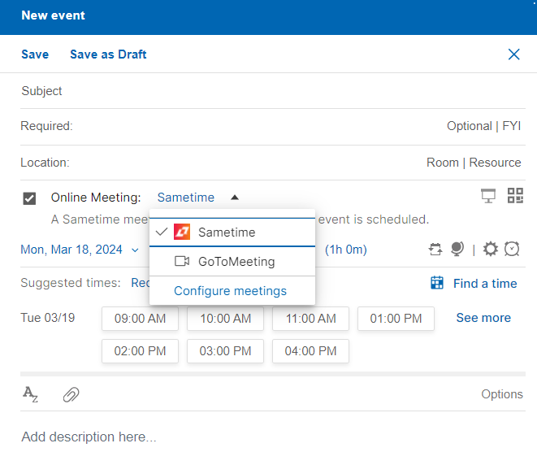

# How do I integrate an online meeting?

Available from HCL Verse 3.2.1 onwards, users can generate a dynamic link to meetings on the following services - GoToMeeting, Microsoft Teams, WebEx, Zoom, and Sametime.

The following are prerequisites:

-   You need account credentials to register one or more of these services.
-   **For Sametime only**: The Sametime service is only supported:
    -   On Sametime 12.0.2 and above.
    -   When Sametime/Domino are setup for SSO \(Single Sign On\).

**Note:** In order to use this feature, users must have a Notes ID in the ID Vault, or in the Mail file. The ID is needed to encrypt the OAuth tokens in the profile.

You can create, update, and delete meetings on the following services- GoToMeeting, Microsoft Teams, WebEx, Zoom, and Sametime. For more information, see [Enabling dynamic online meeting services](../admin/enabling_domi_online_meetings.md).

**Note:** If a delegated user opens another user's mail file and create a meeting using the Sametime service, the Sametime meeting is created in the delegated user's Sametime account. If the permissions of the meeting need to be modified, the delegated user can do so from Sametime.

**Note:** Meetings created using these services will use the default meeting settings of the selected service.

To enable any listed meeting services, follow these steps:

1.  Go to **Verse Settings** &gt; **Calendar** &gt; **Online Meeting Service Configuration**.

    

2.  Select the meeting service, that you want to enable, from the list. In the **Enable meeting service** dialog box, click on **Get Token**.

    

3.  In the web window that opens, enter your credentials for the meeting service you are registering.

4.  Copy the token, return to the **Enable meeting service** dialog box, and paste the value in the token box. Click **Save**. Your selected meeting service is now enabled.

    Once the service is enabled, you can disable the service or edit the service details in the **Verse Settings** &gt; **Calendar** &gt; **Online Meeting Service Configuration**.

    

    You can now use the enabled service when scheduling a new meeting.

    

    **Limitations:**

    -   Beginning with HCL Verse 3.2.2 along with Domino 14.0 FP1 or higher and 12.0.2 FP4 or higher, you can change the online meeting service of repeating meeting instances to or from a dynamic meeting service after the meeting has been created.

    -   You cannot create a meeting using one of the services for a meeting that is being created in the past.
    **Note:** Because the OAuth spec requires that transmission of OAuth tokens be done over secure connections, the connection between the browser client and the Domino server must use TLS. If Domino receives request containing OAuth credentials from the browser over an insecure connection, the request will be rejected. This means that if the Domino server is in a "green zone" where secure requests are downgraded to insecure by an internet appliance, then you must configure the appliance to not downgrade requests for /verse/domi/\* endpoints.

**Parent topic:** [How do I manage my calendar?](../user/faq_calendar.md)

**Related information**  

[Enabling dynamic online meeting services](../admin/enabling_domi_online_meetings.md)

[How do I schedule a meeting?](faq_calendar_bar_create.md)

