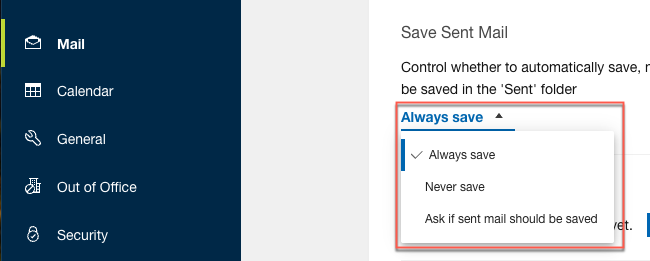
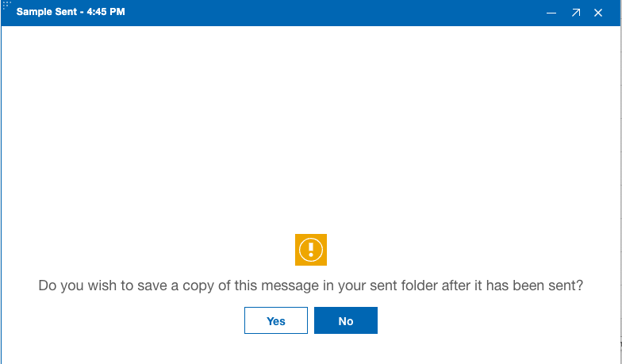

# How can I choose to save sent mail?

You can decide whether to save your sent messages on the {{ shortVerseProductName }} settings page. You can choose to save all sent messages, not save any sent messages, or be prompted to save each message when you send it.

**Note:** The "Save sent mail" policy setting can be used to control this setting in the Desktop settings document under Preferences/Mail \(see [Domino 14.5 documentation](https://help.hcl-software.com/domino/14.5.0/admin/conf_specifying_preferences_for_a_desktop_policy_t.html)\).

**Procedure:**

1.  Go to the **{{ shortVerseProductName }} Settings** &gt; **Mail** &gt; **Save Sent Mail**.
2.  Choose from the three options to save sent mail:

    

    -   **Always save** - This is the default option if the preference has never been set. As you send mail, the messages will be saved in the **Sent** folder.
    -   **Never save** - As you send mail, the messages will not be saved in the **Sent** folder.
    -   **Ask if sent mail should be saved** - This option prompts when you press the **Send** button when composing mail. 

**Parent topic:** [How do I personalize {{ shortVerseProductName }}?](../user/faq_settings.md)

