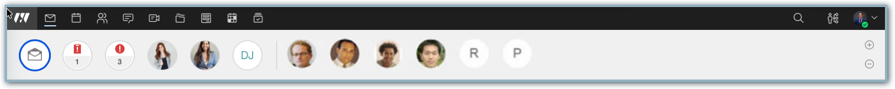
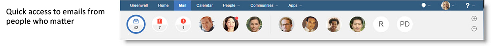
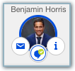
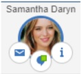
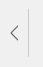
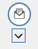

# Why do I see people in the top bar?

One of the main aspects of {{ fullVerseProductName }} that sets it apart is that it lets you have, within easy reach, all the things that are important to you. People are a big part of this idea.


At the top are the people that are important to you, which gives you a great deal of flexibility in how you interact with your colleagues and contacts.


At the top are the people and communities that are important to you, which gives you a great deal of flexibility in how you interact with your colleagues and contacts.

 

Mouse over to send mail to the contact, start a chat, or view the contact's business card information.




 
A red dot on a person means you have new mail from a person important to you.


Each contact is shown with a photo, if available. Otherwise, you'll see their initials. Click a contact to show all mail from that contact in your Inbox.


Each contact is shown with a profile photo, if available. Otherwise, you'll see their initials. Click a contact to show all mail from that contact in your Inbox.

 
Every time you open {{ fullVerseProductName }}, the bar is updated with your most used and recent contacts. But if there are people you want to make sure remain in the bar, you can add them as a favorite, so that they will always be there. To do so, either drag the person past the divider bar to the Favorites section, or use the '**+**' button to add them from a search. Your favorites will always display in the bar when you load {{ fullVerseProductName }}.




 

Add or remove a favorite or suggested person by clicking the add or remove icon. 




 
Finally, you can collapse the top bar to get it out of the way by selecting the arrow icon next to the first name on the list.  To get the bar back to its expanded size again, select the new arrow under the mail icon. 

**Parent topic:** [User Documentation](../user/welcometoibmverse.md)

