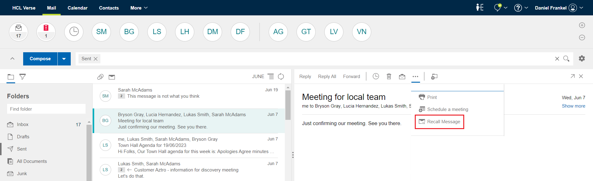
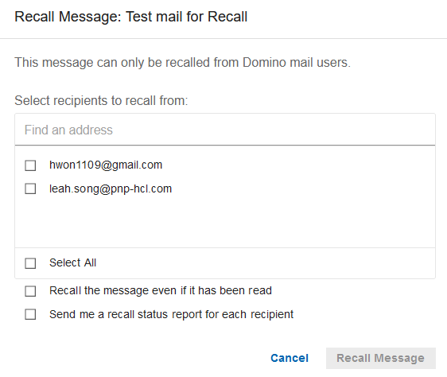
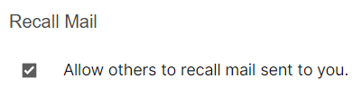

# How can I recall a sent message?

You can now recall a sent message by clicking **Recall Message** from the overflow drop down menu. You can recall only one message at a time.

When you click on **Recall Message**, a dialog appears in which you can select the recipients and the desired options to recall the sent message.

In the Mail section of Verse Settings, you can choose to allow or not allow others to be able to recall mail they sent to you. The checkbox is selected by default. If you deselect the checkbox, others will not be able to recall messages sent to you.

**Note:** If you select *Send me a recall status report*, you will receive an email with the status of the recall request. If the status report contains a *recall was not allowed* status message, the message recipient may have disabled the preference to allow message recall, or the administrator has not enabled this feature for the files on your mail server.

**Parent topic:** [How do I master mail?](../user/Verse_mail.md)

