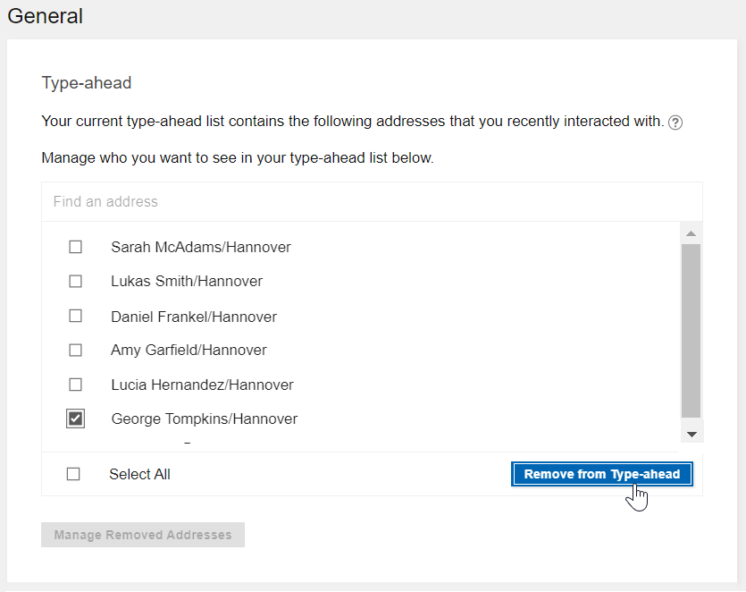
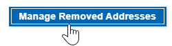
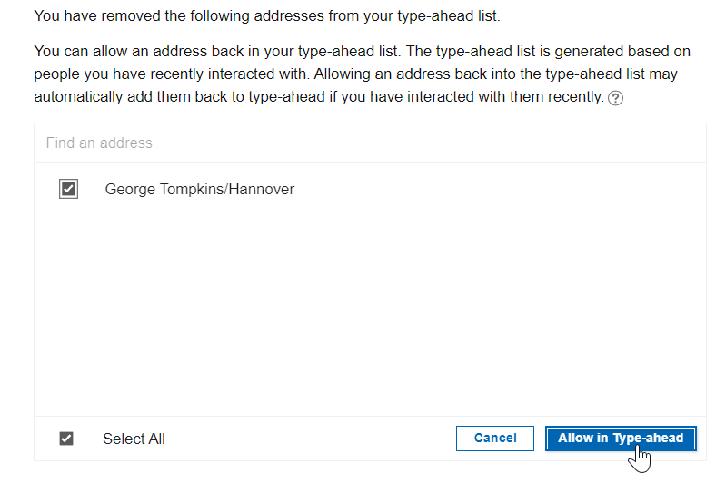

# How do I remove unused addresses from my type-ahead list?

Use the Type-ahead setting to remove addresses that you don't use from your type-ahead list.

When you begin to type an address in a names field such as the To field in new message, type-ahead automatically shows you a list of matching addresses to choose from.

You can remove addresses from this list. For example, if there are two addresses for one person but you use only one, you can remove the address that you don't want to use.

To remove an address from your type-ahead list:

1.  Open **{{ shortVerseProductName }} Settings:**

    

2.  Go to **General** settings.
3.  Select the address to remove from type-ahead and click **Remove from Type-ahead**.

    

Should you want to add it back later, follow these steps:

1.  Click **Manage Removed Addresses** to display addresses you have removed.

    

2.  Select the address and click **Allow in Type-ahead**.

    

**Parent topic:** [How do I personalize {{ shortVerseProductName }}?](../user/faq_settings.md)

