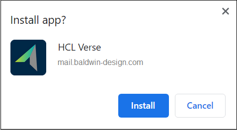
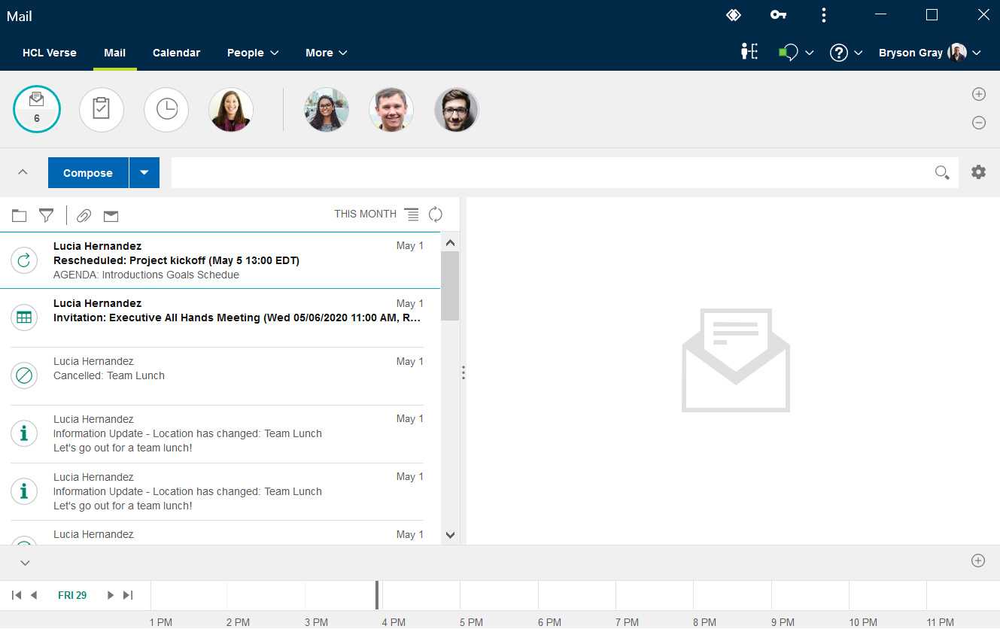

# How do I run {{ shortVerseProductName }} as a standalone app?


Beginning with HCL Verse 2.0, you can install and run HCL Verse as a standalone browser app that is based on progressive web app (PWA) technology.

You can install and run {{ fullVerseProductName }} as a standalone browser app that is based on progressive web app (PWA) technology.


As a PWA, {{ shortVerseProductName }} runs in its own window rather than as a tab in your browser. You start and stop it as you do other installed browser apps.


{{ shortVerseProductName }} as a standalone browser app is currently supported for the following browsers.

Verse as a standalone browser app is currently supported for the following browsers. For supported browser versions, see the [Verse 2.0 system requirements](https://support.hcl-software.com/csm?id=kb_article&sysparm_article=KB0041937).


-   Chrome on Microsoft™ Windows™, Mac OS, and Android
-   Microsoft™ Edge \(80+\) on Microsoft™ Windows™
-   Apple Safari on iOS

To install {{ shortVerseProductName }} as a standalone app:

1.  Log in to {{ shortVerseProductName }} through the server browser URL, for example: `https://baldwin-design.com/verse`.

2.  Install the {{ shortVerseProductName }} app.

    The browser may indicate that there is an app to be installed. For example, on Chrome running on Windows, a + icon is shown in the browser bar, which you can click to install the {{ shortVerseProductName }} app:

    

    

    On some browsers the prompt to install {{ shortVerseProductName }} is shown automatically

    On mobile devices, you are given instructions about how to add the {{ shortVerseProductName }} app to your home screen.

{{ shortVerseProductName }} immediately starts in its own window. Stop, start, or uninstall {{ shortVerseProductName }} just as you do other installed browser apps.





**Parent topic:** [User Documentation](../user/welcometoibmverse.md)

