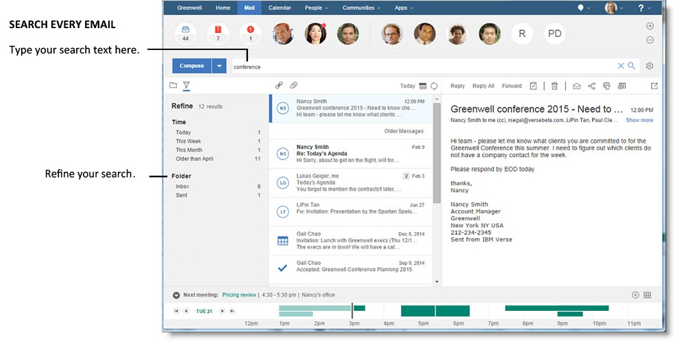
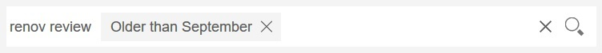
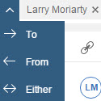
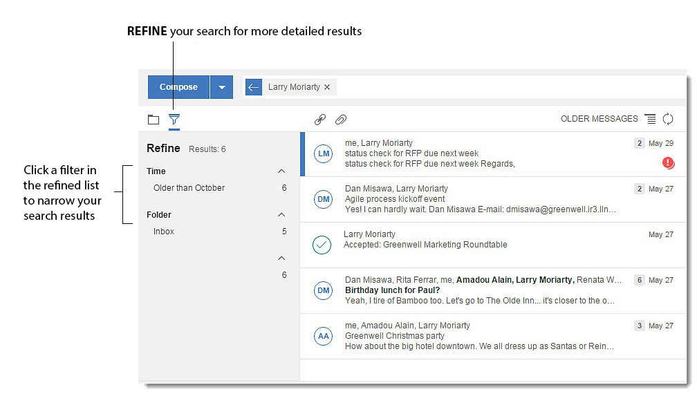
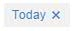
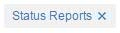
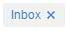
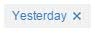
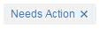

# How do I find what I'm looking for?

One of the most powerful and useful features of HCL Verse is its dynamic and analytics-driven search capacity. Search through every piece of mail with precision and ease.

You'll see that the search bar is above your inbox and below the people in the top bar.



Enter text into the bar, and HCL Verse searches through all of your content for matches. Even if you are in your Inbox when you type into the search bar, you're searching all documents. Search will even look for search terms in messages in folders, and suggest search terms for you as you type. Select any of them to run the search without having to type the entire string. Note that the suggestions are only for people and folders.

Remove any filter from the search bar \(and the resulting search\) by clicking on the "x" next to the name. You can clear all filters from the Search Bar by clicking the "x" at the far end of the Search Bar.



Here are some more features that Verse provides to make it easy for you to find what you need.

-   Find messages to and from a particular person by clicking their picture or by typing their name. If you want to, filter the results to show only messages to them or from them.
-   Refine search results by time or folder location.
-   Find messages that contain particular words \(keywords\). For example, find messages that contain all specified words, at least one of specified words, or just a part of a word.
-   Combine search filters, for example, find messages from a particular person in your inbox only.

For more information on these features and others, see the following sections.

## Filtering by person

You can filter by person by clicking on a person's picture in the important person area or on their business card. When you select a person, a filter tag with their name appears in the search field. By default you will only see messages sent by that person, but you can also choose to view messages sent *to* that person or *to and from* that person. Just click the arrow next to their name in the search field, and choose the option you want.



Some examples:

<table markdown id="table_g13_51j_pt"><thead><tr><th>

Filter tags

</th><th>

Results

</th><th>

Exact syntax

</th></tr></thead><tbody><tr><td>


</td><td>

This returns messages that were sent by Larry Moriarty.

</td><td>

This is the same as:

```
from:"Larry Moriarty"
```

</td></tr><tr><td>


</td><td>

This returns messages that were sent to Larry Moriarty.

</td><td>

This is the same as:
```
to:"Larry Moriarty"
```

</td></tr><tr><td>


</td><td>

This returns messages that were sent by and to Larry Moriarty.

</td><td>

This is the same as:
```
all:"Larry Moriarty"
```

</td></tr></tbody>
</table>## Refining search results

You can also refine your search results using the **Refine search results** panel.



From here you can see options for filtering your messages. When you select an option, a filter tag appears in the search field.

-   **Time**

    Lets you scope your messages to a specific time frame, such as Today or This Week.

-   **Folder**

    Lets you scope your messages to a specific folder, such as Status Reports, All Documents, or Inbox.


Some examples:

<table markdown id="table_snt_gz3_pt"><thead><tr><th>

Filter tags

</th><th>

Results

</th><th>

Exact syntax

</th></tr></thead><tbody><tr><td>



</td><td>

This returns messages that were received Today.

</td><td>

This is the same as
```
date:Today
```

</td></tr><tr><td>



</td><td>

This returns messages that are in the Status Reports folder.

</td><td>

This is the same as:
```
folder:"Status Reports"
```

</td></tr></tbody>
</table>## Searching by keyword

The most basic search available is a keyword search. Keywords are any words you type in the search field that do not appear as filter tags. Search looks for exact matches of keywords in the body of all messages.

-   Type any single keyword to search for messages that include that word.
-   Type more than one word to search for messages that include all those words.
-   Put double quotes around a phrase to search for messages that include that exact phrase.

    **Note:** Single quotes \('\) will not work, only double quotes \("\).

-   Type 'OR' between keywords to search for messages that include any of those words.
-   Type an '\*' \(asterisk\) attached to your keyword to search for messages that include that partial word.

Some examples:

|Keywords|Results|
|--------|-------|
|status|This returns messages that contain the word "status".|
|status report|This returns messages that contain the words "status" AND "report", but not necessarily next to each other.|
|"status report"|This returns messages that contain the exact phrase "status report".|
|status OR report|This returns messages that contain "status" OR "report".|
|key\*|This returns messages that contain "key" as part of a word, such as key, keys, keyword, keynote.|

## Typing filters in the Search field

You can add filters in the search field and select them from the menu that appears. After selecting one, your message list is refined.

If you don't select a filter from the menu it won't be added as a filter tag and will instead be treated as a keyword.

## Combining filters

You can select more than one filter from the refined list to narrow your results even further. Some examples:

<table markdown id="table_ggm_3bj_pt"><thead><tr><th>

Filter tags

</th><th>

Results

</th><th>

Exact syntax

</th></tr></thead><tbody><tr><td>

 

</td><td>

This returns messages from Larry Moriarty AND are in my Inbox.

</td><td>

This is the same as: 
```
from:"Larry Moriarty" AND folder:Inbox
```

</td></tr><tr><td>

  

</td><td>

This returns messages from Larry Moriarty AND are in my Inbox AND were received Today.

</td><td>

This is the same as:
```
from:"Larry Moriarty" AND folder:Inbox AND date:Today
```

</td></tr></tbody>
</table>You can also combine filters, then separate them with 'OR' to return messages that include any one of the filters. Some more examples:

<table markdown id="table_hss_fcj_pt"><thead><tr><th>

Filter tags

</th><th>

Results

</th><th>

Exact syntax

</th></tr></thead><tbody><tr><td>

 OR 

</td><td>

This returns messages received Today OR Yesterday.

</td><td>

This is the same as:
```
date:"Today" OR date:"Yesterday"
```

</td></tr><tr><td>

 OR 

</td><td>

This returns messages sent by Larry Moriarty OR Dan Misawa.

</td><td>

This is the same as:
```
from:"Larry Moriarty" OR from:"Dan Misawa"
```

</td></tr><tr><td>

 OR 

</td><td>

This returns messages from Inbox or the Status Reports folder.

</td><td>

This is the same as:
```
folder:Inbox OR folder:"Status Reports"
```

</td></tr></tbody>
</table>## Working with Needs Action and Waiting For

When you are viewing Needs Action or Waiting For lists, you can also use person, folder, and time filter tags. For example:

 

This returns messages marked as Needs Action AND sent by Larry Moriarty.

## Troubleshooting

Colons are special characters used in advanced searches. If the keyword or phrase you are searching for includes a colon put double quotes around the whole keyword or phrase.

**Parent topic:** [User Documentation](../user/welcometoibmverse.md)

