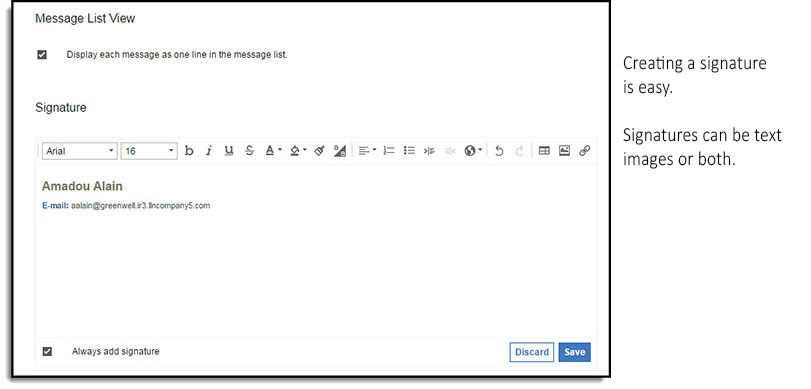

# How do I add a signature to my mail messages?

You can add a signature to append to all your mail messages using HCL Verse.

You can create a signature for your mail messages by selecting **Verse Settings** from the menu under your photo in the navigation bar. Look for the **Signature** section and click **Edit**. Signatures can be text, images or both. You can choose whether or not to have your signature included in all mail that you compose by selecting **Always add signature**.

If you choose not to automatically include your signature in your mail messages, you add it manually by clicking **Insert Signature** on the Options panel in the Compose view.

**Note:** Images in signatures can be type jpg, bmp, gif, or png and must be 32KB or less.

**Parent topic:** [How do I master mail?](../user/Verse_mail.md)

