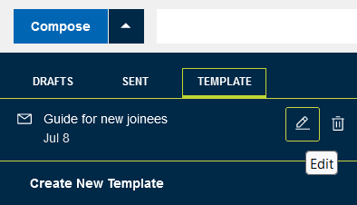
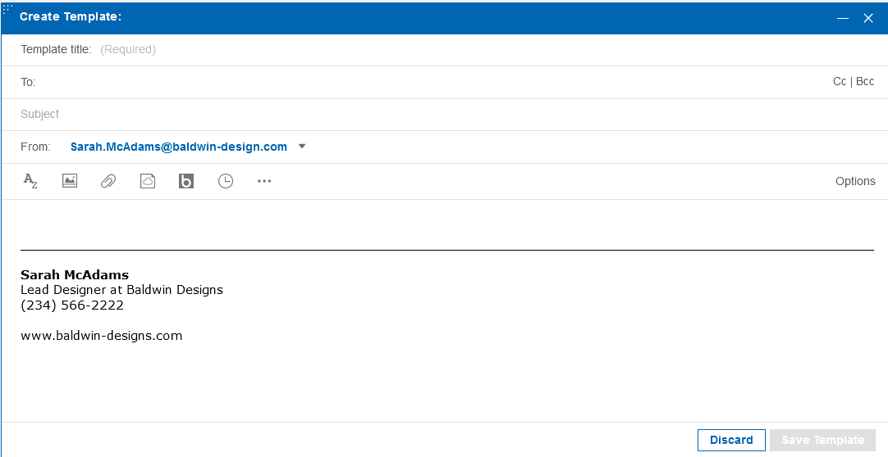
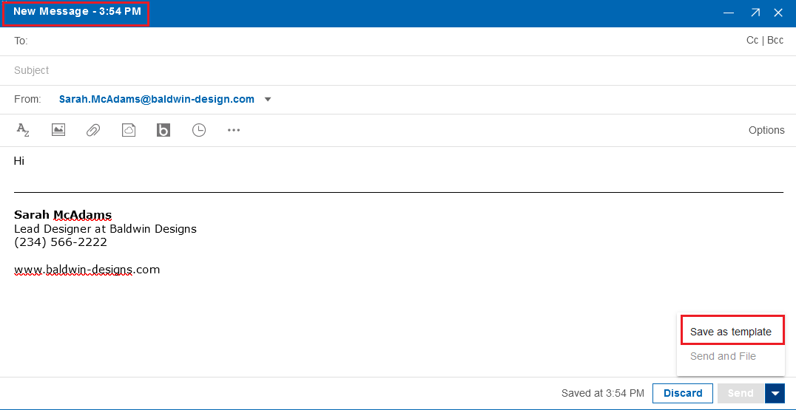

# How do I create and use Templates?

You can create new email templates with text or graphics and a recipient list that you can re-use for your mail messages. This is convenient when you frequently send a message, such as a status report, in the same format to the same people.

Click on the drop down tray next to **Compose**. You can find an option for **Templates**. Clicking on **Create New Template** directs you to a new window to create and save the template. Later, you can edit or delete the saved template.

Another option to create a template is from the Compose New message window. When composing a new mail, you can find an option to save it as template in the pop up tray next to the **Send** button.

To send a new message using the template, click on the template in the template list.

-   To edit a template, click on the **Edit** icon when hovering over the template in the template list.
-   To delete a template, click on the **Delete** icon when hovering over the template in the template list.

**Parent topic:** [How do I master mail?](../user/Verse_mail.md)

