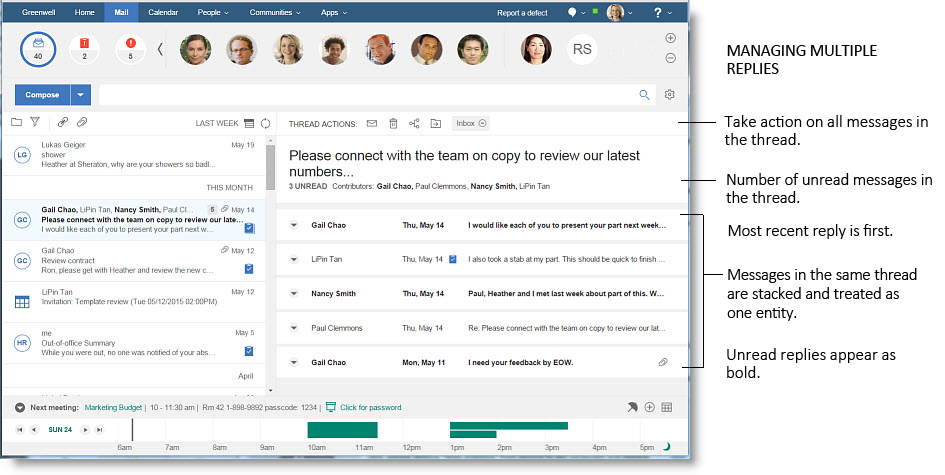

# How do I organize all those mail threads?

{{ fullVerseProductName }} adds a graphical thread style to mail messages that lets you keep all your mail organized and easily viewable within your inbox.

The following control indicates that messages in the same "thread" are stacked and treated as one entity within the message list:

You can click the control to disable threaded messages, in which case the icon changes as follows:

When threaded message are enabled, threads with unread messages are bolded, while threads with messages marked high priority are given a red exclamation point icon to easily identify them. Messages that you sent previously are labeled **SENT**.

**Note:** The message list, by default, shows the recipients, date/time, subject, and a snippet of the message on three separate lines. You can switch to a view that shows one message on each line. Click the icon for your current profile picture, then select **{{ shortVerseProductName }} Settings**. This menu contains additional configurable settings for {{ fullVerseProductName }}.

To open a thread, simply click on it from the message view. The most recent message in the thread displays first, with older messages appearing collapsed underneath it, each with a header displaying the sender, send date and the first few lines of the message. You can uncollapse the older messages by selecting the twistie next to the header.

At the top of each thread is a header which displays the subject of the thread, the names of the original senders, as well as the number of unread messages in the thread, if there are any.

**Note:** You can change the width of the message list to a size that you like by simply dragging the separator from side to side.

There is also an action bar, which lets you perform the following functions in the thread as a whole:

-   Mark all as unread/read

-   Move all to trash

-   Move all to folder

-   Remove from folder

**Note:** These actions will not have an effect on incoming messages in the same thread.

You can also perform all the regular functions you would expect with your mail on a message by message basis within the thread, like replying, forwarding, marking as Needs Action or Waiting For, and viewing the report-to information for people on the message, either by opening the message itself, or hovering your mouse over its header in the message list.

You can delete individual messages that are a part of a thread, but they will be moved to Trash, and will no longer show up as part of the thread. If you want to remove a message from your Inbox, but keep it as part of the thread, use the **Remove from Inbox** button instead. The message will be moved out of your Inbox, but you can still access it from the All Documents folder, and it will remain part of the thread view.

**Parent topic:** [How do I master mail?](../user/Verse_mail.md)

