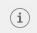
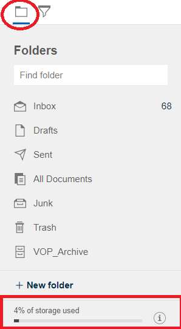
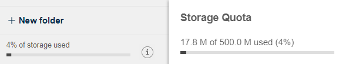
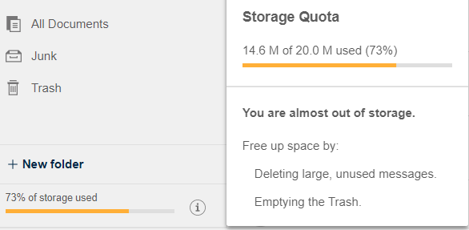
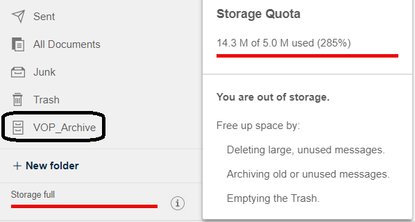

# How can I see my mail storage quota?

If your administrator sets a mail file quota to limit the size of your mail file, you can see how close your mail file is to quota.

Look at the **% of storage used** information at the bottom of the **Folder** panel. Click the  icon for more information about the quota.

## When you are below quota

When your mail file is below the storage limit, you get information about your used and unused storage.

## When you are approaching quota

When your mail file is almost out of storage space, you should free up space by deleting messages, or emptying the trash, or archiving messages if you have an archive mail file.

## When you exceed quota

When you exceed quota, you can't send or receive messages. When your mail file is out of storage space, you should free up space by deleting messages, or emptying the trash, or archiving messages if you have an archive mail file.

**Parent topic:** [User Documentation](../user/welcometoibmverse.md)

**Related information**  

[How can I manage my archived mail?](faq_archived_mail_.md)

[Domino administrator documentation on setting mail file quotas](https://help.hcltechsw.com/domino/14.5.0/admin/conf_settingmailfilequotas_c.html)

