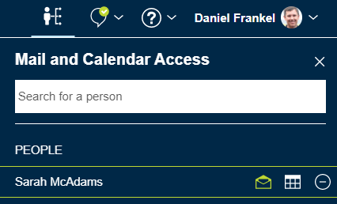
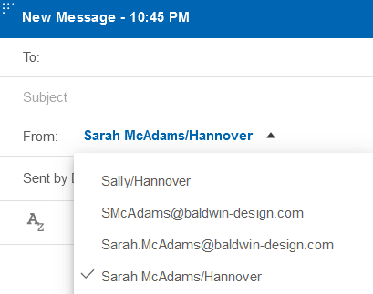
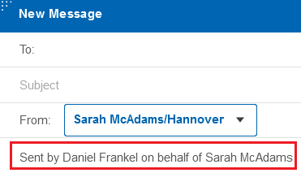

# How do I use an alternate address when sending mail from a delegated mail file?

When you are a delegate for someone else's mail file, you can choose which of their alias addresses to use when you send mail on their behalf.

This feature requires Domino version 12.0.1 FP1 or higher. All mail files should use the Domino 12 mail template.

1.  Click **Verse Settings** &gt; **Mail** and in the **Sent From Addresses** section select **Enable sending message from your email aliases**.

2.  Click the  icon in the navigation bar to open the delegation panel for Mail and Calendar Access list.

3.  Select the name of the account to open and click the mail or calendar icon to open it.

    

4.  Click **Compose** and in the **From** field select an address of the other user from the dropdown list. Text below the From field indicates that you are sending the message on behalf of the mail file owner.

    

    

**Parent topic:** [How do I manage the address I send emails from?](../user/how_do_i_manage_sent_from_mails.md)

**Related information**  

[How do I delegate access to my mail, calendar, and contacts?](faq_mail_delegation_access_on_prem.md)

[How do I access mail and calendars delegated to me?](faq_delegated_access_to_me_on_prem.md)

