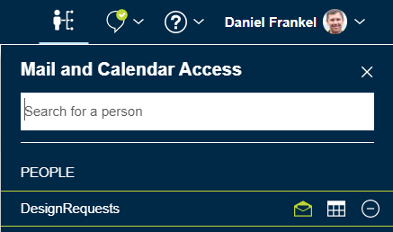
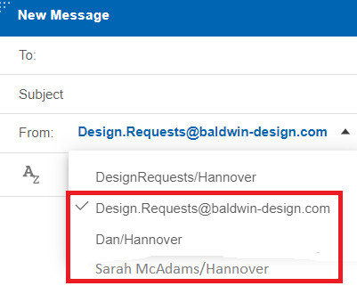

# How do I use an alternate address when sending mail from a shared mail file?

If you choose a shared mail file \(mail-in database\), then you can pick an alternate address when sending an email.

This feature requires Domino version 12.0.1 FP1 or higher. All mail files should use the Domino 12 mail template. In addition, you must select the **Enable Alternate From Feature** preference with the Notes client. For more information, see Notes documentation: [Selecting an alternate From address in a shared mail file](https://help.hcl-software.com/notes/14.5.0/client/select_alternate_from.html?hl=enable%2Calternate%2Cfrom%2Cfeature "Selecting an alternate From address in a shared mail file").


A shared mail file can be used by multiple users to send and receive emails through one mail file. You can choose the address to use when sending mail from a shared mail file.

Follow these steps:

1.  Click the  icon in the navigation bar to open the delegation panel for Mail and Calendar Access list. For more information, see **How do I open a mail-in database**. Choose the mail icon for the desired mail-in database.

    

2.  Click **Compose**. In the **From** field, select the address to send from. This address can be your address, the mail-in database address, or the address of another user of the database that grants you this access through the Notes client.

    

**Parent topic:** [How do I manage the address I send emails from?](../user/how_do_i_manage_sent_from_mails.md)

**Related information**  

[How do I open a mail-in database?](faq_mailindatabase.md)

[Notes documentation: Selecting an alternate From address in a shared mail file](https://help.hcltechsw.com/notes/12.0.0/client/select_alternate_from.html)

