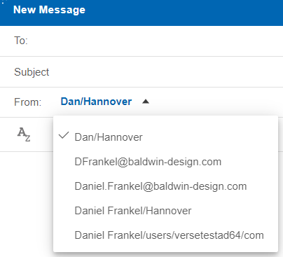

# How do I use an alternate address when sending mail from my mail file?

When using your mail file, you can send mail from any one of your alias addresses.

**Note:** This feature requires Domino version 12.0.1 FP1 or higher. All mail files should use the Domino 12 mail template.

Click **Verse Settings** &gt; **Mail** and in the **Sent From Addresses** section select **Enable sending message from your email aliases**.

Next, click **Compose** and in the **From** field select the address to use from the dropdown list.

**Parent topic:** [How do I manage the address I send emails from?](../user/how_do_i_manage_sent_from_mails.md)

