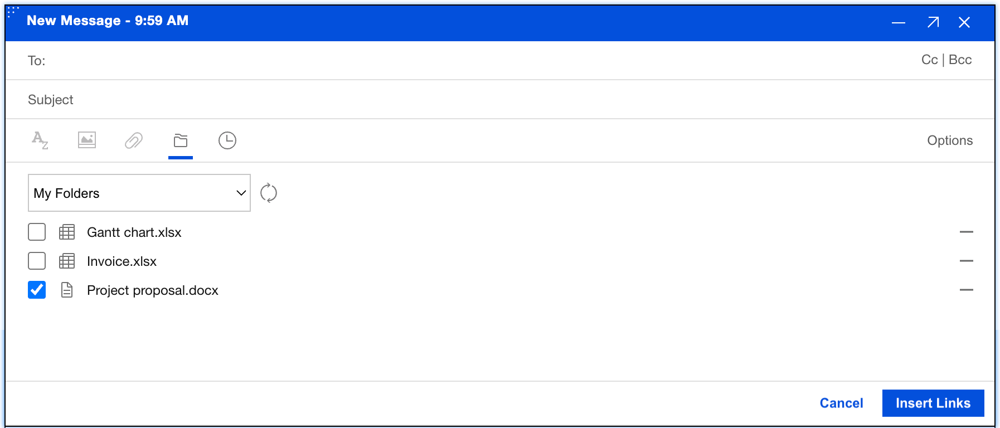
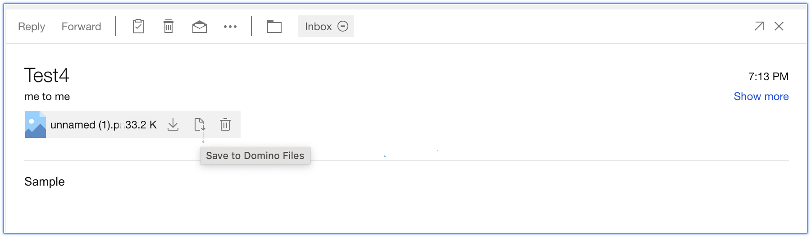
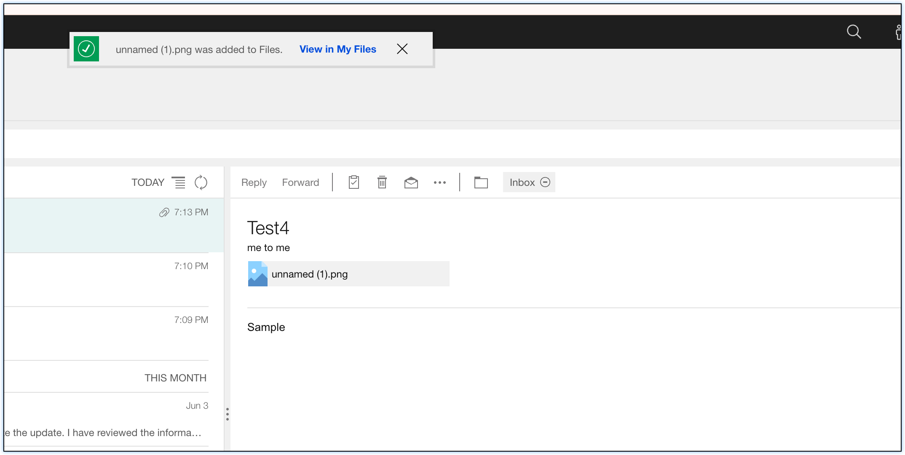

# How do I send file links and save mail attachments to Domino Workspace Files?

Instead of clogging up mailboxes with heavy attachments, {{ shortVerseProductName }} allows you to send secure hyperlinks and offload incoming files directly to your Domino Workspace Files.

Domino Files is a centralized file repository that gives you the ability to securely store and share files with others. Instead of sending heavy email attachments, this integration allows you to send a link of any file hosted on Domino Files directly to a user. Additionally, you have the ability to upload received email attachments straight to Domino Files, keeping your inbox light.

##  How to insert a file link into an email?
### Procedure:

1. Go to your Inbox.
2. Click Compose/Reply/Reply All.
3. On the Attachments, click the files icon caption as "Share from Domino Files".

4. Click the Files icon (or the Box icon, depending on your corporate environment) on the formatting bar.
5. Browse your cloud folders, check the files you want to share.
6. Click **Insert Links**.

7. Click **Send**.

!!! note
    When you click Send, it opens a share linked files. The system will automatically attempt to grant file-viewing permissions to everyone on your To/Cc list behind the scenes.

## How to upload an email attachment to your Domino files?
### Procedure:
Use this method when someone sends you a heavy file and you want to save it to your cloud drive and clear up space in your inbox.

1. Open the incoming email containing the attachment.
2. Hover your mouse over the attached file icon and click in the *Save to Domino File* icon option.

3. When *Saved*, there is notification link that you can view the files on your cloud storage.

!!! note
    The link redirects to a new page containing your saved cloud storage files.
