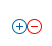
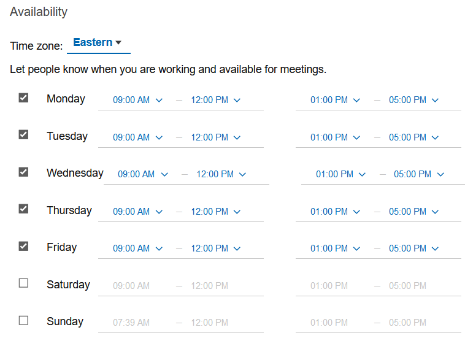

# How do I set my availability preferences?

You can set availability preferences to let people know when you're available for meetings.


This feature requires Domino 12 or higher or Domino 11.0.1 FP4 or higher FP or Domino 10.0.1 FP8 or higher FP.


Customize your availability in the **{{ shortVerseProductName }} Settings** &gt; **Calendar** &gt; **Availability** section and set your preferred time zone, available days and hours. You can add or delete the timeline using the  icons.

**Note:** The time zone set here is only used in relation to your availability. For example, if you are traveling, you can set your availability for a particular day and time in any time zone.

**Parent topic:** [How do I manage my calendar?](../user/faq_calendar.md)

