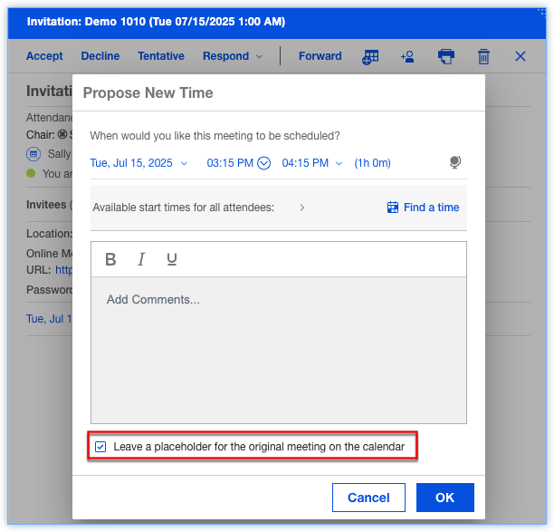
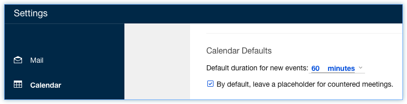

# How do I leave a placeholder when proposing a new time for a meeting?

When proposing a new time for a meeting, invitees now have an option to leave a placeholder for the original time of the meeting in their calendar.

**Note:** This option is available when using Verse 3.2.5 and Domino 14.5.

1.  Open a meeting invitation.

2.  Click the **Respond ⏵ Propose New Time** button.

3.  Choose a new time for the meeting.

4.  Check the **Leave a placeholder for the original meeting on the calendar** option and click **OK**.

    

5.  In the Calendar, the meeting will remain at the original time and will display with a **Countered**label.

6.  If the chair of the meeting accepts the new time, all attendees will receive a notification with the rescheduled details. When the attendee accepts the reschedule, the placeholder will be removed from the Calendar.

    **Note:** There is a setting in the Calendar settings that controls the default value of the **Leave a placeholder for the original meeting on the calendar**option. The option is **By default, leave a placeholder for countered meetings.**

    

**Parent topic:** [How do I manage my calendar?](../user/faq_calendar.md)

