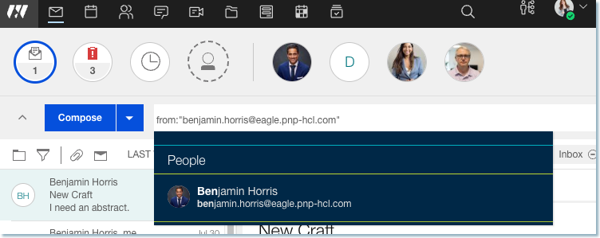
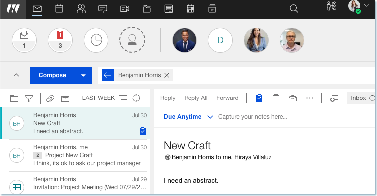

# How to search for emails from a user sent by a delegatee?

If you receive an email sent by a delegated user \(for example, an executive administrator\) on behalf of another user \(for example, an executive\), you can search for that email by searching for emails 'from' the executive.


**Note:** This capability was added in Verse 3.2.5


1.  Receive an email from an executive that was sent by the executive's administrator.
    

2.  In the search bar, type the executive's name and choose the executive from the type-ahead list.

    

    
 
3.  In the search results, you can see the email from the executive.

    

    
 

    **Note:** This capability requires updates to mail file designs. See [Applying the {{ shortVerseProductName }} search view changes to existing mail files](../admin/applying_the_verse_search_view.md) for more information.


**Parent topic:** [How do I manage the address I send emails from?](../user/how_do_i_manage_sent_from_mails.md)

