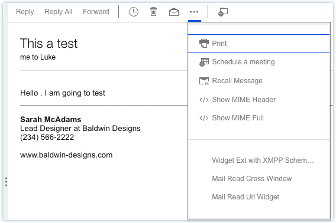
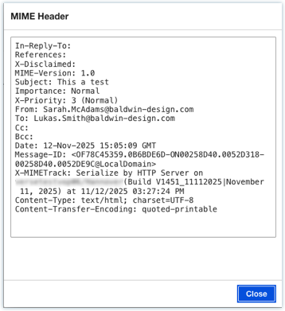
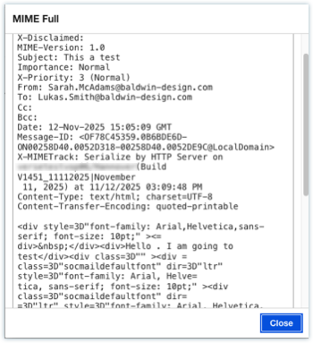

# How to view MIME headers and MIME full content?

Click the ellipsis \(\) icon on the received messages and click the Show MIME Header or Show MIME Full action.

**Parent topic:** [How do I master mail?](../user/Verse_mail.md)

