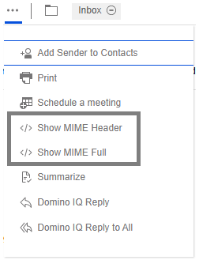

# How to view MIME headers and MIME full content?

1. Click the ellipsis \(\) icon on the received messages.

       
   
2. Click the Show MIME Header or Show MIME Full action.
3. Click Close.

**Parent topic:** [How do I master mail?](../user/Verse_mail.md)

