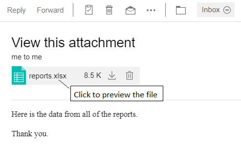
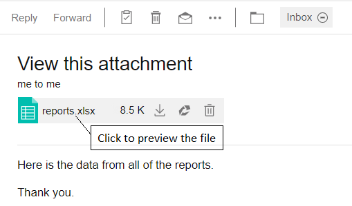

# How can I view file attachments before I download them with {{ fullVerseProductName }}?

When someone sends you an attachment, you may be able to preview the contents of the attachment. The types of files that you can preview depend on how your administrator has configured the server.


You are able to preview the contents of Microsoft Office documents and images by clicking on the attachment. From the viewer, you are able to download that file.   

## Using Domino File Viewer
If your administrator has configured the server to use the Domino File Viewer option, you are able to preview the contents of Microsoft Office documents and images by clicking on the attachment. From the viewer, you are able to download that file. For more information, see [Enabling file preview using Domino File Viewer](../admin/enabling_file_preview_using_domino1202.md).
 
  


## Using Connections

If your administrator has integrated HCL Connections, you are able to preview the contents of a spreadsheet, document, presentation, PDF, and an image. From the viewer, you are be able to download that file or upload that file \(to Connections\).



**Parent topic:** [How do I master mail?](../user/Verse_mail.md)

